# Домашнее задание к занятию «Введение в Terraform»

### Цели задания

1. Установить и настроить Terrafrom.
2. Научиться использовать готовый код.

------

### Чек-лист готовности к домашнему заданию

1. Скачайте и установите **Terraform** версии >=1.12.0 . Приложите скриншот вывода команды ```terraform --version```.
2. Скачайте на свой ПК этот git-репозиторий. Исходный код для выполнения задания расположен в директории **01/src**.
3. Убедитесь, что в вашей ОС установлен docker.  
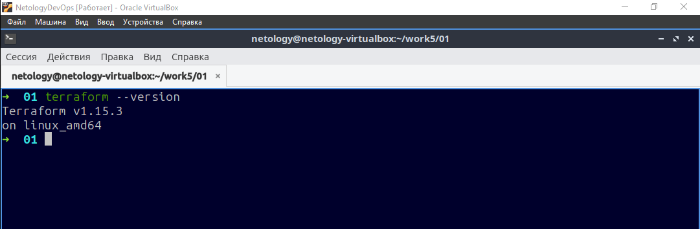
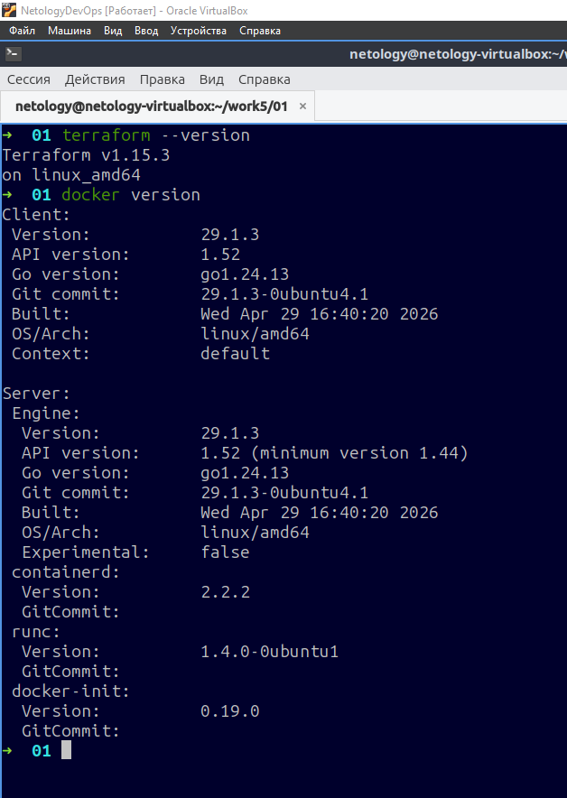

------

### Задание 1

1. Перейдите в каталог [**src**](https://github.com/netology-code/ter-homeworks/tree/main/01/src). Скачайте все необходимые зависимости, использованные в проекте.   
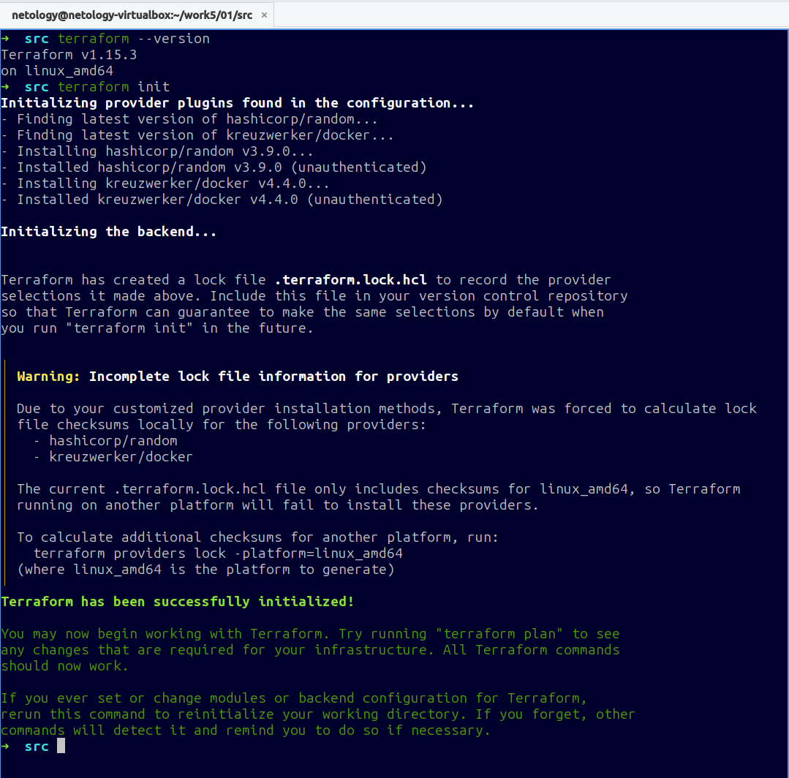  

2. Изучите файл **.gitignore**. В каком terraform-файле, согласно этому .gitignore, допустимо сохранить личную, секретную информацию?(логины,пароли,ключи,токены итд)  

    - По всей вероятности, секретные данные должны быть в файле ```personal.auto.tfvars```

3. Выполните код проекта. Найдите  в state-файле секретное содержимое созданного ресурса **random_password**, пришлите в качестве ответа конкретный ключ и его значение. 
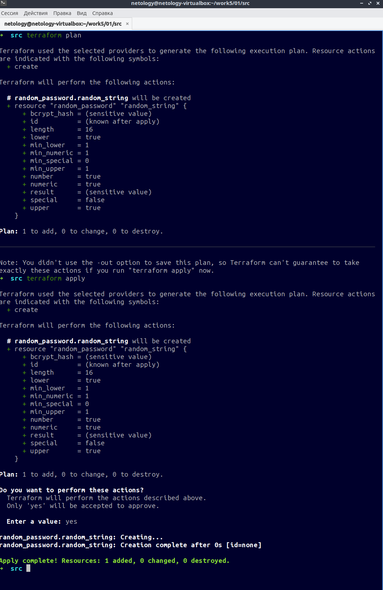  
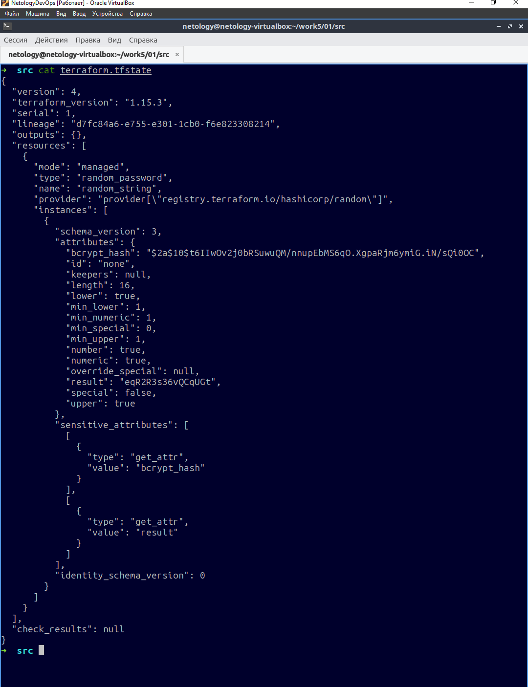  

4. Раскомментируйте блок кода, примерно расположенный на строчках 29–42 файла **main.tf**.
Выполните команду ```terraform validate```. Объясните, в чём заключаются намеренно допущенные ошибки. Исправьте их.  
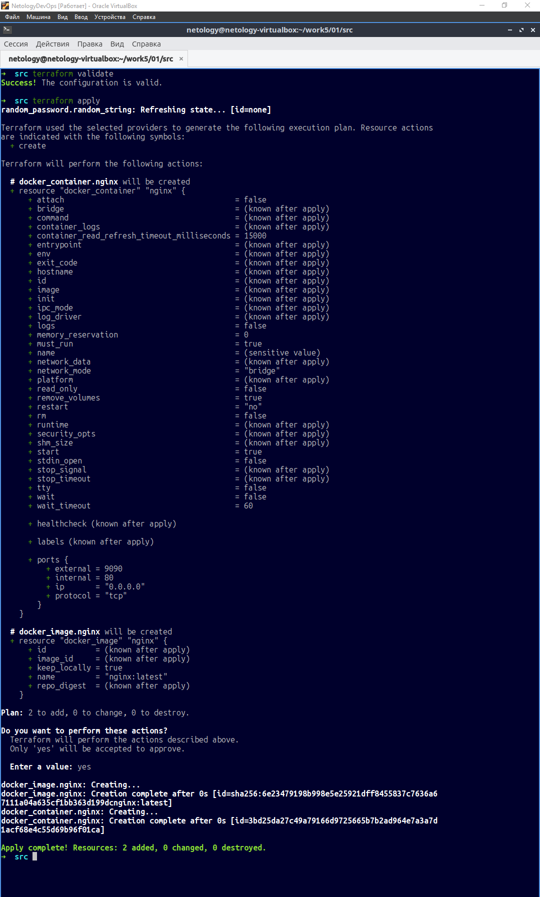  
```random_string_FAKE``` -->> ```random_string```  
```resulT``` -->> ```result```  
```1nginx``` -->> ```nginx```  
```resource "docker_image"``` -->> ```resource "docker_image" "nginx" {```  

5. Выполните код. В качестве ответа приложите: исправленный фрагмент кода и вывод команды ```docker ps```.  
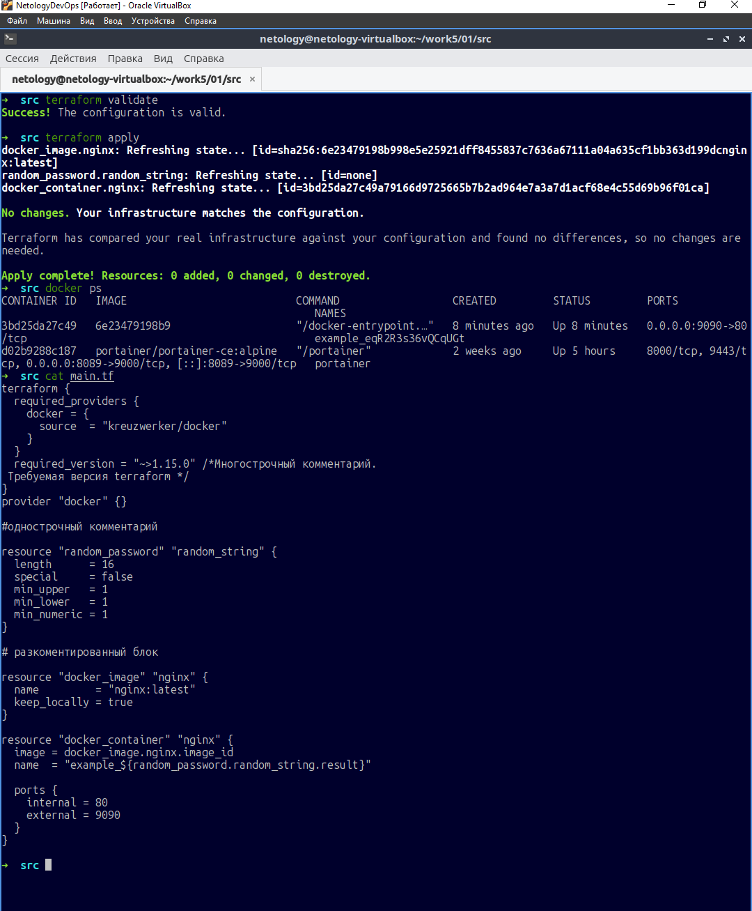  
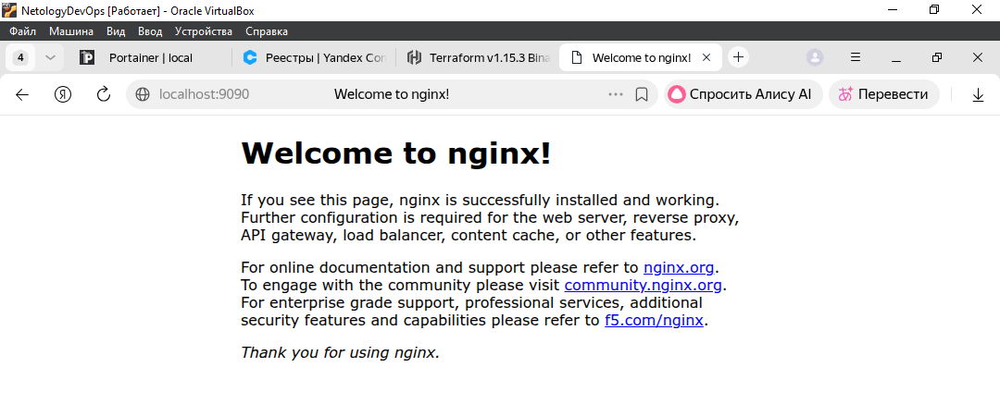

6. Замените имя docker-контейнера в блоке кода на ```hello_world```. Не перепутайте имя контейнера и имя образа. Мы всё ещё продолжаем использовать name = "nginx:latest". Выполните команду ```terraform apply -auto-approve```.
Объясните своими словами, в чём может быть опасность применения ключа  ```-auto-approve```. Догадайтесь или нагуглите зачем может пригодиться данный ключ? В качестве ответа дополнительно приложите вывод команды ```docker ps```.  
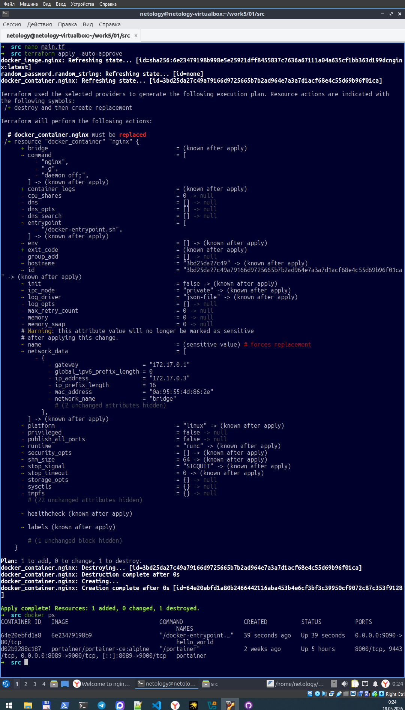  
```-auto-approve``` - авто-подтвердления всех запровосов.  
Это опасно: действия могут быть безвозвратными, например удаление данных и неожиданные изменения инфраструктуры.  
Может быть полезно для автоматизации, где ввод невозможен, например, при многократных развертнываниях или автотестах проектов.

7. Уничтожьте созданные ресурсы с помощью **terraform**. Убедитесь, что все ресурсы удалены. Приложите содержимое файла **terraform.tfstate**.  
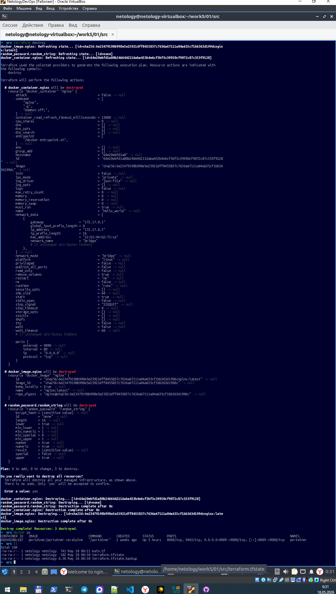  
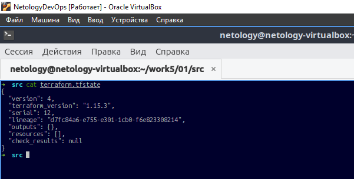

8. Объясните, почему при этом не был удалён docker-образ **nginx:latest**. Ответ **ОБЯЗАТЕЛЬНО НАЙДИТЕ В ПРЕДОСТАВЛЕННОМ КОДЕ**, а затем **ОБЯЗАТЕЛЬНО ПОДКРЕПИТЕ** строчкой из документации [**terraform провайдера docker**](https://library.tf/providers/kreuzwerker/docker/latest).  (ищите в классификаторе resource docker_image )  
    - Образ ```nginx:latest``` остался из-за настройки ```keep_locally = true``` (оставляет образ на локальном хосте)
    - Описание параметра дано в [документации](https://library.tf/providers/davidthor/docker/latest/docs/resources/image): `keep_locally (Boolean) If true, then the Docker image won't be deleted on destroy operation. If this is false, it will delete the image from the docker local storage on destroy operation.`


------

