# Домашнее задание к занятию «Управляющие конструкции в коде Terraform»

### Цели задания

1. Отработать основные принципы и методы работы с управляющими конструкциями Terraform.
2. Освоить работу с шаблонизатором Terraform (Interpolation Syntax).

------

### Чек-лист готовности к домашнему заданию

1. Зарегистрирован аккаунт в Yandex Cloud. Использован промокод на грант.
2. Установлен инструмент Yandex CLI.
3. Доступен исходный код для выполнения задания в директории [**03/src**](https://github.com/netology-code/ter-homeworks/tree/main/03/src).
4. Любые ВМ, использованные при выполнении задания, должны быть прерываемыми, для экономии средств.

------

### Внимание!! Обязательно предоставляем на проверку получившийся код в виде ссылки на ваш github-репозиторий!
Убедитесь что ваша версия **Terraform** ~>1.12.0  
Теперь пишем красивый код, хардкод значения не допустимы!

------
------

### Задание 1

1. Изучите проект.
2. Инициализируйте проект, выполните код. 


Приложите скриншот входящих правил «Группы безопасности» в ЛК Yandex Cloud .

------

_**Выполнение**_:  
1. Инициализировал проект.
2. Получил OAuth-токен по документации: https://cloud.yandex.ru/docs/iam/concepts/authorization/oauth-token
3. Выполнил код и получил ошибку
    ```
    rpc error: code = InvalidArgument desc = OAuth token for user 'aj...1', issued after '2026-06-01', is not supported for IAM token exchange
    ```  
    Цитата из [документации](https://yandex.cloud/ru/docs/iam/concepts/authorization/oauth-token):
    ```md
    **Аутентификация по OAuth-токенам больше не поддерживается**

    С 1 июня 2026 года сервис аутентификации не принимает новые OAuth‑токены, полученные через Яндекс ID. Токены, выданные до 1 июня 2026 года, продолжают действовать до истечения срока жизни.
    ```  
4. Изменил вход на сервисный аккаунт (как в предыдущем задании).  
5. Выполнил код.  
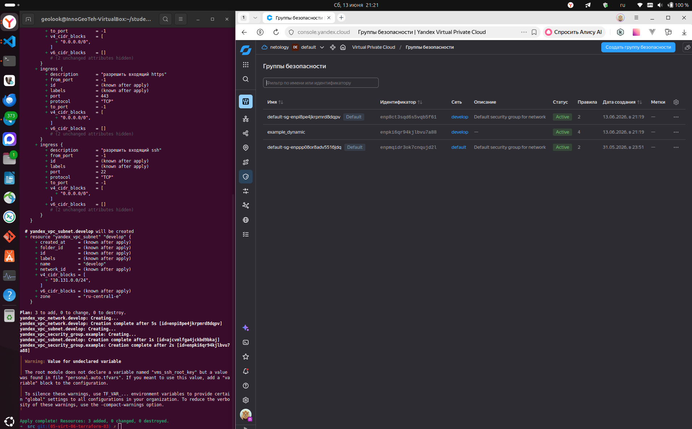

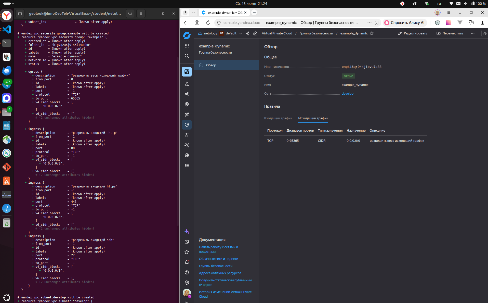
Проект инициализирован, ресурсы созданы.
Группа безопасности `example_dynamic` отображается в ЛК с правилами для SSH (22), HTTP (80), HTTPS (443).

------
------

### Задание 2

1. Создайте файл count-vm.tf. Опишите в нём создание двух **одинаковых** ВМ  web-1 и web-2 (не web-0 и web-1) с минимальными параметрами, используя мета-аргумент **count loop**. Назначьте ВМ созданную в первом задании группу безопасности.(как это сделать узнайте в документации провайдера yandex/compute_instance )
2. Создайте файл for_each-vm.tf. Опишите в нём создание двух ВМ для баз данных с именами "main" и "replica" **разных** по cpu/ram/disk_volume , используя мета-аргумент **for_each loop**. Используйте для обеих ВМ одну общую переменную типа:
```
variable "each_vm" {
  type = list(object({  vm_name=string, cpu=number, ram=number, disk_volume=number }))
}
```  
При желании внесите в переменную все возможные параметры.
3. ВМ, описанные в файле count-vm.tf, должны создаваться после ВМ, описанных в файле for_each-vm.tf.
4. Используйте функцию file в local-переменной для считывания ключа ~/.ssh/id_rsa.pub и его последующего использования в блоке metadata, взятому из ДЗ 2.
5. Инициализируйте проект, выполните код.

------

_**Выполнение**_:  
1. Создал файлы `count-vm.tf` и `for_each-vm.tf` для создания `двух одинаковых` ВМ (_web-1_ и _web-2_) после `двух разных` ВМ (_main_ и _replica_) по cpu/ram/disk_volume (_выбраны значения доступные для платформы_).
2. Параметры частично вынесены в переменные.
3. В процессе выполнения и отладки столкнулся с ограничением на использование публичных IP:
    ```
    Plan: 7 to add, 0 to change, 0 to destroy.
    yandex_vpc_network.develop: Creating...
    yandex_vpc_network.develop: Creation complete after 2s [id=enpo65tfjmkreod7r0o4]
    yandex_vpc_subnet.develop: Creating...
    yandex_vpc_security_group.example: Creating...
    yandex_vpc_subnet.develop: Creation complete after 1s [id=ajcsnsgbr0mefp94ii86]
    yandex_compute_instance.db["main"]: Creating...
    yandex_compute_instance.db["replica"]: Creating...
    yandex_vpc_security_group.example: Creation complete after 2s [id=enpmo1uqimm4dvt1dtsl]
    ╷
    │ Error: Error while requesting API to create instance: client-request-id = 9a77284e-7de8-4a3b-b05c-ae840228a384 client-trace-id = 43c55b65-bf5b-41b9-b909-adc79c647dfd rpc error: code = ResourceExhausted desc = Quota vpc.externalAddressesCreation.rate exceeded
    │ 
    │   with yandex_compute_instance.db["replica"],
    │   on for_each-vm.tf line 1, in resource "yandex_compute_instance" "db":
    │    1: resource "yandex_compute_instance" "db" {
    │ 
    ╵
    ╷
    │ Error: Error while requesting API to create instance: client-request-id = 7530b74b-0be0-415a-951b-f9eba74398c3 client-trace-id = 43c55b65-bf5b-41b9-b909-adc79c647dfd rpc error: code = ResourceExhausted desc = Quota vpc.externalAddressesCreation.rate exceeded
    │ 
    │   with yandex_compute_instance.db["main"],
    │   on for_each-vm.tf line 1, in resource "yandex_compute_instance" "db":
    │    1: resource "yandex_compute_instance" "db" {
    │ 
    ╵
    ```
    Первоначально проблема возникла с созданием `web-1`, после создания ВМ для _БД_, ожидание ничего не дало - машины не создавались и спустя 12 и 24 часа.  
    После удаления всех ресурсов и попытки начать всё сначала ошибка появилась уже при разворачивании ВМ для _БД_ `main` и `replica` (текст ошибки приведён выше).  
    Поддержка сообщила, что лимит в консоли не отображается и при этом распространяется на всё облако независимо от зоны доступности, и управляется только через них - описал ситуацию и ожидаю увеличение лимита.  
    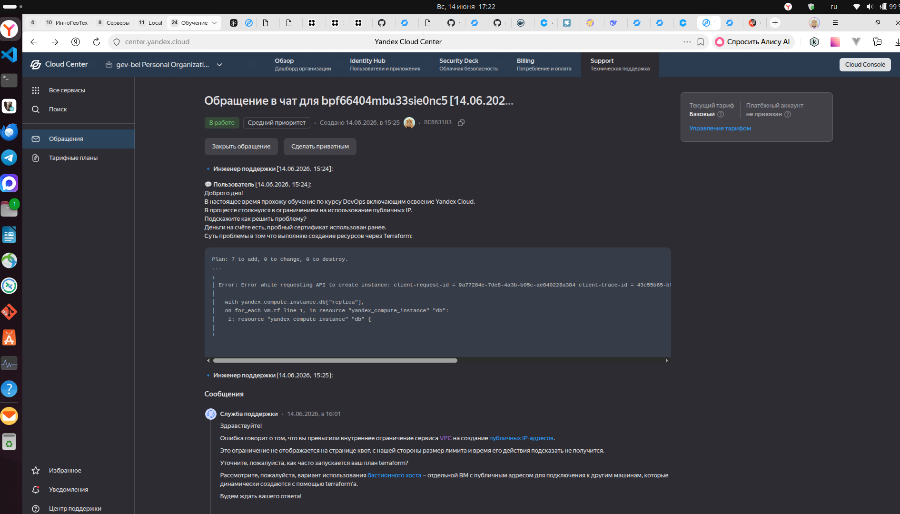  
    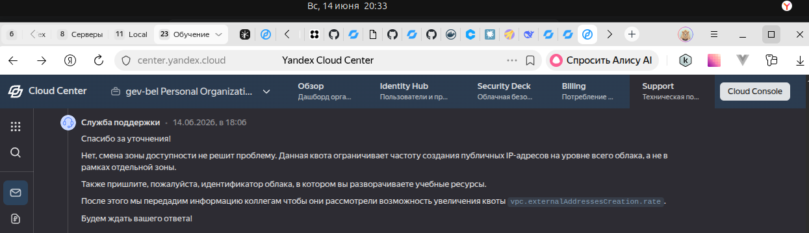  
  4. Пока выполнил развертывание с использованием [NAT-шлюза по документации](https://yandex.cloud/ru/docs/vpc/operations/create-nat-gateway#tf_1), что примерно соответствует _Заданию 9* предыдущего ДЗ_:  
      * Создал `nat.tf`  
      * Использовал его через `route_table_id` в `main.tf`  
      * С `network_interface { nat = false }` в `count-vm.tf` и `for_each-vm.tf`  

  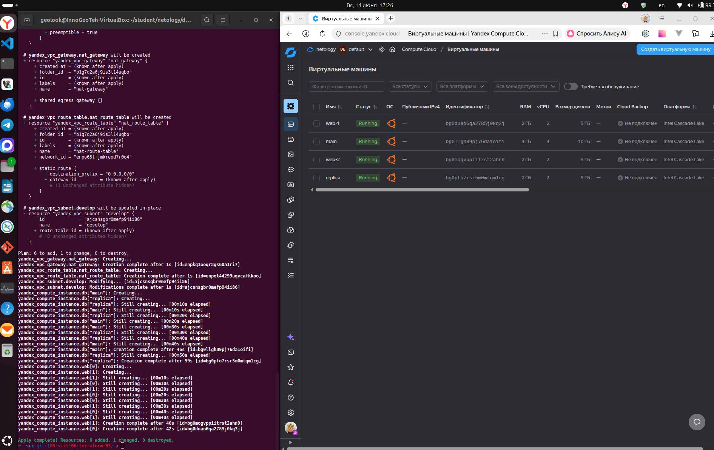  
  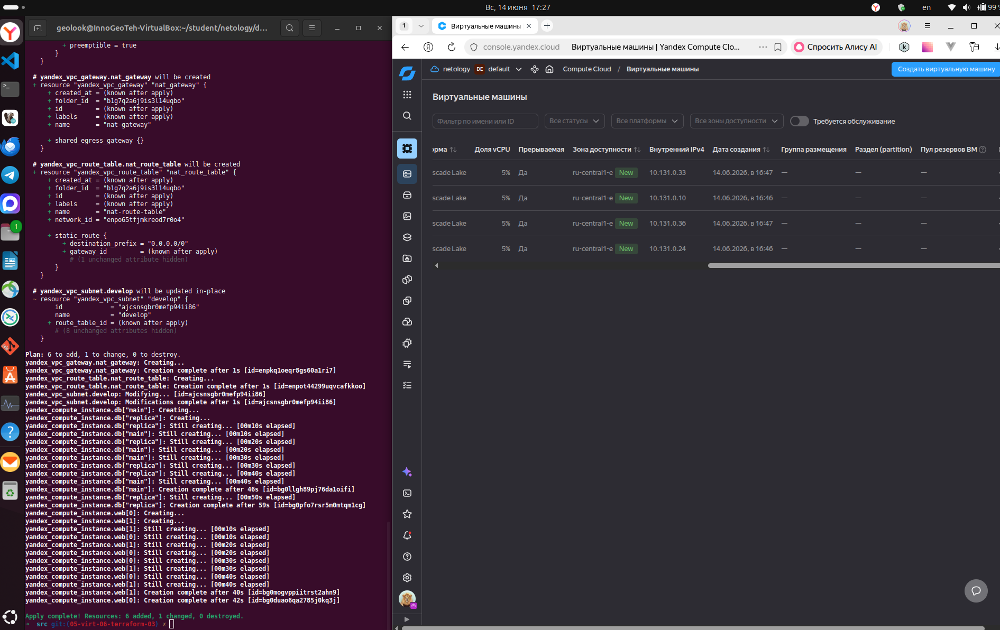  

------
------

### Задание 3

1. Создайте 3 одинаковых виртуальных диска размером 1 Гб с помощью ресурса yandex_compute_disk и мета-аргумента count в файле **disk_vm.tf** .
2. Создайте в том же файле **одиночную**(использовать count или for_each запрещено из-за задания №4) ВМ c именем "storage"  . Используйте блок **dynamic secondary_disk{..}** и мета-аргумент for_each для подключения созданных вами дополнительных дисков.

------

_**Выполнение**_:  
1. Создал файл `disk_vm.tf` с ресурсами `storage_disks` и `storage` описывающими диски и ВМ (минимальный размер диска на платформе не 1 Гб, а 5 Гб).
2. Параметры ВМ вынес и обобщил в `vms_variables.tf`, в связи с чем обновил `count-vm.tf`.

  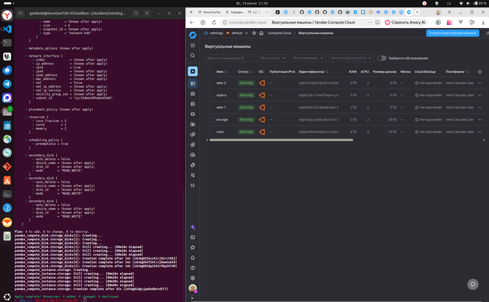  
  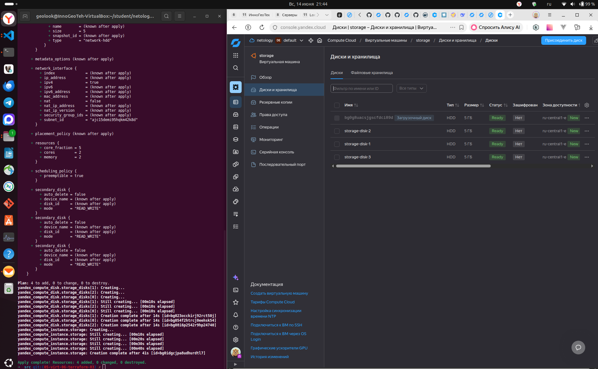  
  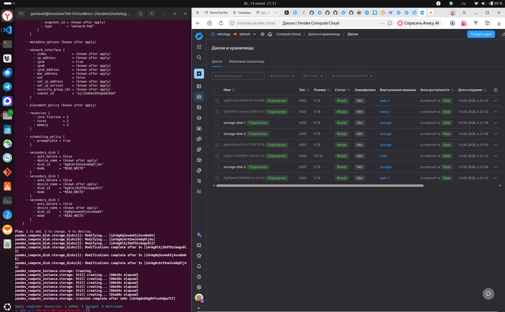  

  В консоли Яндекс Облака появилась ВМ `storage` c дисками общим объёмом 50 Гб (_загрузочный и 3 дополнительный - каждый минимального размера 5 Гб_).  
  Диски видны через ВМ и через список дисков в консоли облака.  

------
------

### Задание 4

1. В файле ansible.tf создайте inventory-файл для ansible.
Используйте функцию tepmplatefile и файл-шаблон для создания ansible inventory-файла из лекции.
Готовый код возьмите из демонстрации к лекции [**demonstration2**](https://github.com/netology-code/ter-homeworks/tree/main/03/demo).
Передайте в него в качестве переменных группы виртуальных машин из задания 2.1, 2.2 и 3.2, т. е. 5 ВМ.
2. Инвентарь должен содержать 3 группы и быть динамическим, т. е. обработать как группу из 2-х ВМ, так и 999 ВМ.
3. Добавьте в инвентарь переменную  [**fqdn**](https://cloud.yandex.ru/docs/compute/concepts/network#hostname).
``` 
[webservers]
web-1 ansible_host=<внешний ip-адрес> fqdn=<полное доменное имя виртуальной машины>
web-2 ansible_host=<внешний ip-адрес> fqdn=<полное доменное имя виртуальной машины>

[databases]
main ansible_host=<внешний ip-адрес> fqdn=<полное доменное имя виртуальной машины>
replica ansible_host<внешний ip-адрес> fqdn=<полное доменное имя виртуальной машины>

[storage]
storage ansible_host=<внешний ip-адрес> fqdn=<полное доменное имя виртуальной машины>
```
Пример fqdn: ```web1.ru-central1.internal```(в случае указания переменной hostname(не путать с переменной name)); ```fhm8k1oojmm5lie8i22a.auto.internal```(в случае отсутвия перменной hostname - автоматическая генерация имени,  зона изменяется на auto). нужную вам переменную найдите в документации провайдера или terraform console.
4. Выполните код. Приложите скриншот получившегося файла. 

Для общего зачёта создайте в вашем GitHub-репозитории новую ветку terraform-03. Закоммитьте в эту ветку свой финальный код проекта, пришлите ссылку на коммит.   
**Удалите все созданные ресурсы**.

------

_**Выполнение**_:  
1. Создал файл шаблона `hosts.tftpl`
2. Создал файл `ansible.tf` использующий функцию `templatefile` и принимающей файл шаблона `hosts.tftpl` (файл `demonstration2` в репозитории отсутствует).
3. Исправлено форматирование `hosts.ini` через исправление `hosts.tftpl` - убраны лишние `~` (подавление пробелов).

  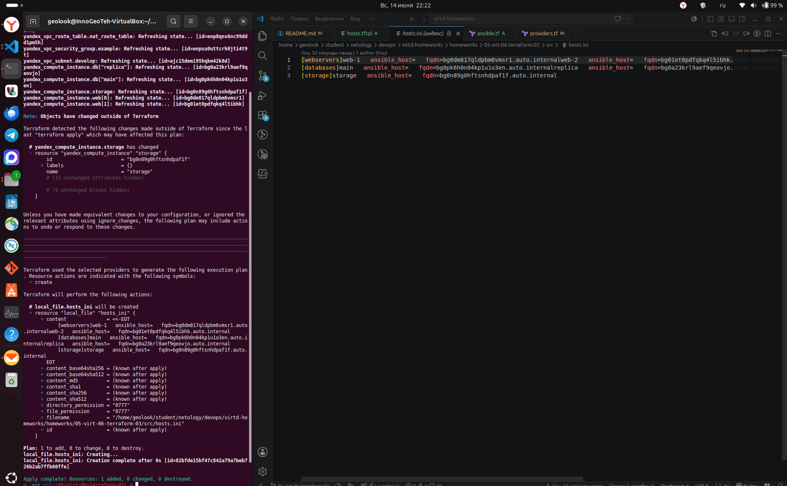  
  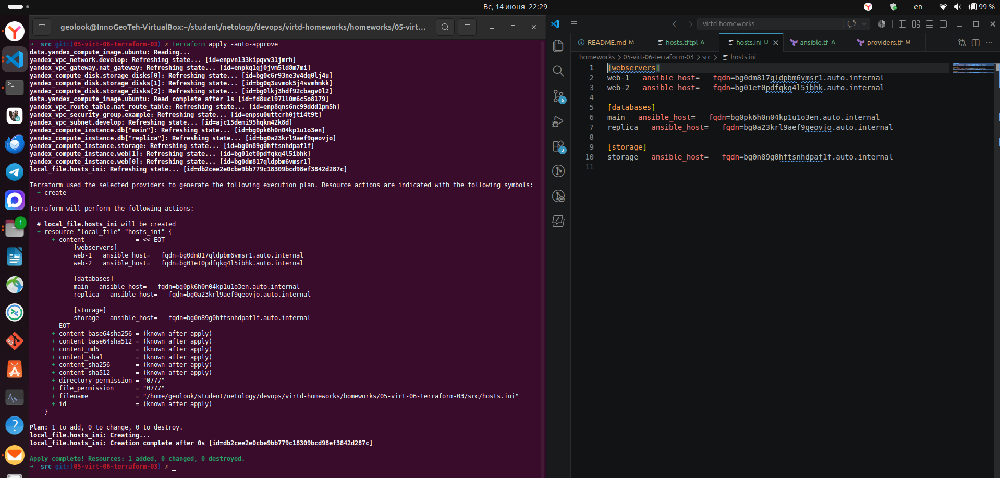   

------
------

## Дополнительные задания (со звездочкой*)

**Настоятельно рекомендуем выполнять все задания со звёздочкой.** Они помогут глубже разобраться в материале.   
Задания со звёздочкой дополнительные, не обязательные к выполнению и никак не повлияют на получение вами зачёта по этому домашнему заданию.

------
------

### Задание 5* (необязательное)

1. Напишите output, который отобразит ВМ из ваших ресурсов count и for_each в виде списка словарей :
``` 
[
 {
  "name" = 'имя ВМ1'
  "id"   = 'идентификатор ВМ1'
  "fqdn" = 'Внутренний FQDN ВМ1'
 },
 {
  "name" = 'имя ВМ2'
  "id"   = 'идентификатор ВМ2'
  "fqdn" = 'Внутренний FQDN ВМ2'
 },
 ....
...итд любое количество ВМ в ресурсе(те требуется итерация по ресурсам, а не хардкод) !!!!!!!!!!!!!!!!!!!!!
]
```
Приложите скриншот вывода команды ```terrafrom output```.

------
------

### Задание 6* (необязательное)

1. Используя null_resource и local-exec, примените ansible-playbook к ВМ из ansible inventory-файла.
Готовый код возьмите из демонстрации к лекции [**demonstration2**](https://github.com/netology-code/ter-homeworks/tree/main/03/demo).
3. Модифицируйте файл-шаблон hosts.tftpl. Необходимо отредактировать переменную ```ansible_host="<внешний IP-address или внутренний IP-address если у ВМ отсутвует внешний адрес>```.

Для проверки работы уберите у ВМ внешние адреса(nat=false). Этот вариант используется при работе через bastion-сервер.
Для зачёта предоставьте код вместе с основной частью задания.

### Правила приёма работы

В своём git-репозитории создайте новую ветку terraform-03, закоммитьте в эту ветку свой финальный код проекта. Ответы на задания и необходимые скриншоты оформите в md-файле в ветке terraform-03.

В качестве результата прикрепите ссылку на ветку terraform-03 в вашем репозитории.

Важно. Удалите все созданные ресурсы.

------
------

### Задание 7* (необязательное)

Ваш код возвращает вам следущий набор данных: 
```
> local.vpc
{
  "network_id" = "enp7i560tb28nageq0cc"
  "subnet_ids" = [
    "e9b0le401619ngf4h68n",
    "e2lbar6u8b2ftd7f5hia",
    "b0ca48coorjjq93u36pl",
    "fl8ner8rjsio6rcpcf0h",
  ]
  "subnet_zones" = [
    "ru-central1-a",
    "ru-central1-b",
    "ru-central1-c",
    "ru-central1-d",
  ]
}
```
Предложите выражение в terraform console, которое удалит из данной переменной 3 элемент из: subnet_ids и subnet_zones.(значения могут быть любыми) Образец конечного результата:
```
> <некое выражение>
{
  "network_id" = "enp7i560tb28nageq0cc"
  "subnet_ids" = [
    "e9b0le401619ngf4h68n",
    "e2lbar6u8b2ftd7f5hia",
    "fl8ner8rjsio6rcpcf0h",
  ]
  "subnet_zones" = [
    "ru-central1-a",
    "ru-central1-b",
    "ru-central1-d",
  ]
}
```

------
------

### Задание 8* (необязательное)

Идентифицируйте и устраните намеренно допущенную в tpl-шаблоне ошибку. Обратите внимание, что terraform сам сообщит на какой строке и в какой позиции ошибка!
```
[webservers]
%{~ for i in webservers ~}
${i["name"]} ansible_host=${i["network_interface"][0]["nat_ip_address"] platform_id=${i["platform_id "]}}
%{~ endfor ~}
```

------
------

### Задание 9* (необязательное)

Напишите  terraform выражения, которые сформируют списки:
1. ["rc01","rc02","rc03","rc04",rc05","rc06",rc07","rc08","rc09","rc10....."rc99"] те список от "rc01" до "rc99"
2. ["rc01","rc02","rc03","rc04",rc05","rc06","rc11","rc12","rc13","rc14",rc15","rc16","rc19"....."rc96"] те список от "rc01" до "rc96", пропуская все номера, заканчивающиеся на "0","7", "8", "9", за исключением "rc19"

------
------

### Критерии оценки

Зачёт ставится, если:

* выполнены все задания,
* ответы даны в развёрнутой форме,
* приложены соответствующие скриншоты и файлы проекта,
* в выполненных заданиях нет противоречий и нарушения логики.

На доработку работу отправят, если:

* задание выполнено частично или не выполнено вообще,
* в логике выполнения заданий есть противоречия и существенные недостатки. 

