# Домашнее задание к занятию «Продвинутые методы работы с Terraform»

### Цели задания

1. Научиться использовать модули.
2. Отработать операции state.
3. Закрепить пройденный материал.


### Чек-лист готовности к домашнему заданию

1. Зарегистрирован аккаунт в Yandex Cloud. Использован промокод на грант.
2. Установлен инструмент Yandex CLI.
3. Исходный код для выполнения задания расположен в директории [**04/src**](https://github.com/netology-code/ter-homeworks/tree/main/04/src).
4. Любые ВМ, использованные при выполнении задания, должны быть прерываемыми, для экономии средств.

------
### Внимание!! Обязательно предоставляем на проверку получившийся код в виде ссылки на ваш github-репозиторий!
Убедитесь что ваша версия **Terraform** ~>1.12.0
Пишем красивый код, хардкод значения не допустимы!
------
------

### Задание 1

1. Возьмите из [демонстрации к лекции готовый код](https://github.com/netology-code/ter-homeworks/tree/main/04/demonstration1) для создания с помощью двух вызовов remote-модуля -> двух ВМ, относящихся к разным проектам(marketing и analytics) используйте labels для обозначения принадлежности.  В файле cloud-init.yml необходимо использовать переменную для ssh-ключа вместо хардкода. Передайте ssh-ключ в функцию template_file в блоке vars ={} .
Воспользуйтесь [**примером**](https://grantorchard.com/dynamic-cloudinit-content-with-terraform-file-templates/) ([локальная копия](dynamic-cloudinit-content-with-terraform-file-templates.md)). Обратите внимание, что ssh-authorized-keys принимает в себя список, а не строку.
3. Добавьте в файл cloud-init.yml установку nginx.
4. Предоставьте скриншот подключения к консоли и вывод команды ```sudo nginx -t```, скриншот консоли ВМ yandex cloud с их метками. Откройте terraform console и предоставьте скриншот содержимого модуля. Пример: > module.marketing_vm
------
В случае использования MacOS вы получите ошибку "Incompatible provider version" . В этом случае скачайте remote модуль локально и поправьте в нем версию template провайдера на более старую.
------

------

_**Выполнение**_:  
1. Скопировал все файлы из `demonstration1/vms` в `src`.
2. Заполнил файл с секретами - `src/personal.auto.tfvars`

    Цитата из [документации](https://yandex.cloud/ru/docs/iam/concepts/authorization/oauth-token):
    ```md
    **Аутентификация по OAuth-токенам больше не поддерживается**

    С 1 июня 2026 года сервис аутентификации не принимает новые OAuth‑токены, полученные через Яндекс ID. Токены, выданные до 1 июня 2026 года, продолжают действовать до истечения срока жизни.
    ``` 
    В связи с этим бала использована авторизация из ДЗ 2 - через сервисный аккаунт.
3. Из-за ограничений доступности репозиториев (включая зеркало яндекс) проведеры, в дополнении к предыдущему ДЗ установлены вручную, а так же, как и прошлой работе, актуализировал версию яндекс провайдера.

    **Провайдер template 2.2.0:**
    
    ```bash
    mkdir -p ~/.terraform.d/plugins/registry.terraform.io/hashicorp/template/2.2.0/linux_amd64/
    
    wget https://hashicorp-releases.yandexcloud.net/terraform-provider-template/2.2.0/terraform-provider-template_2.2.0_linux_amd64.zip
    
    unzip terraform-provider-template_2.2.0_linux_amd64.zip -d ~/.terraform.d/plugins/registry.terraform.io/hashicorp/template/2.2.0/linux_amd64/
    
    chmod +x ~/.terraform.d/plugins/registry.terraform.io/hashicorp/template/2.2.0/linux_amd64/terraform-provider-template_v2.2.0
    ```
4. Загружены репозиторий `terraform-yc-s3` и внешнее описание `dynamic-cloudinit-content-with-terraform-file-templates`.
5. Вынес `ssh_authorized_keys` в переменную `ssh_authorized_keys`.
6. Исправил зону на `ru-central1-e` и платформу на поддерживаемую `standard-v2` (из `source` тянулась не поддерживаемая `standard-v1`).
7. Постарался вынести как можно больше настроек в переменные.
8. Переименовал ВМ и задал `labels`.

ВМ и сети:  
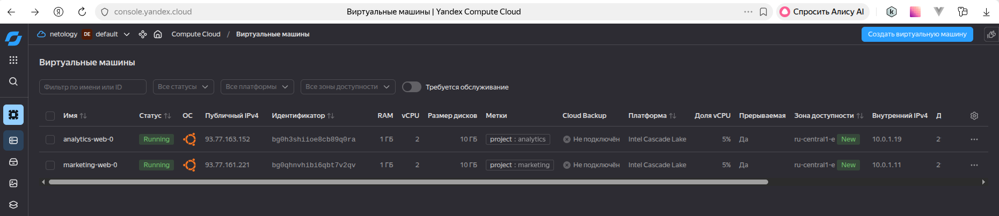  
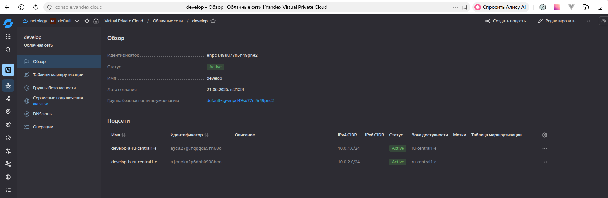  
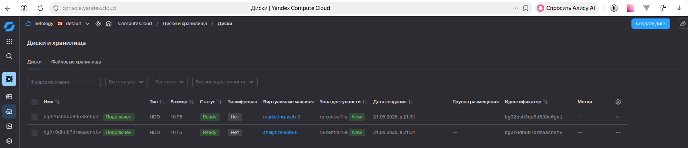  

Проверка nginx в ВМ:  
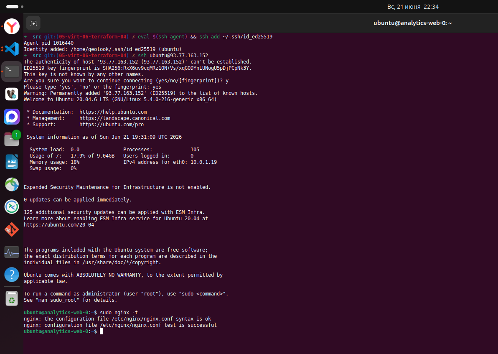  
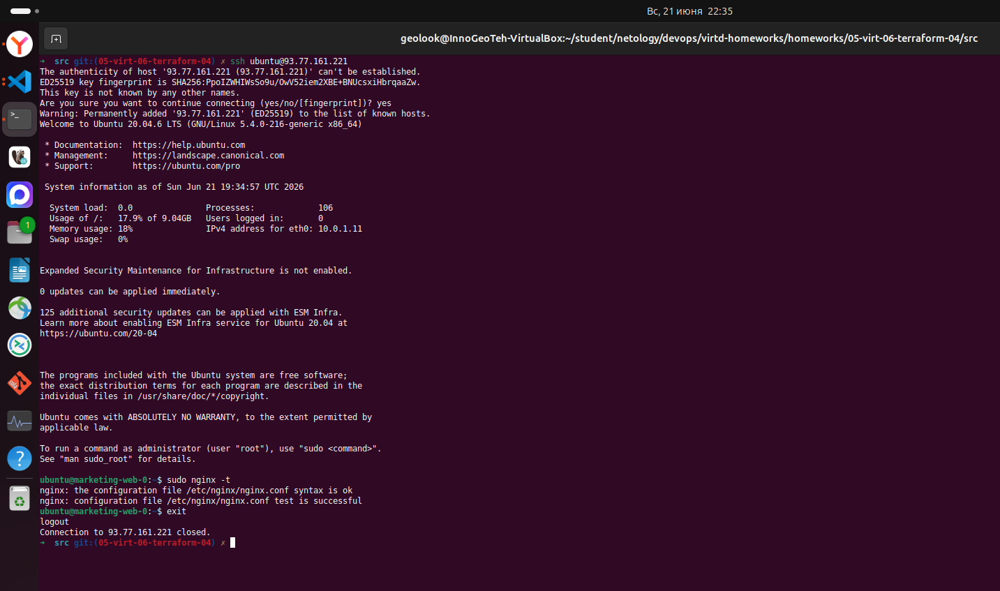  

Проверка содержимого модуля:
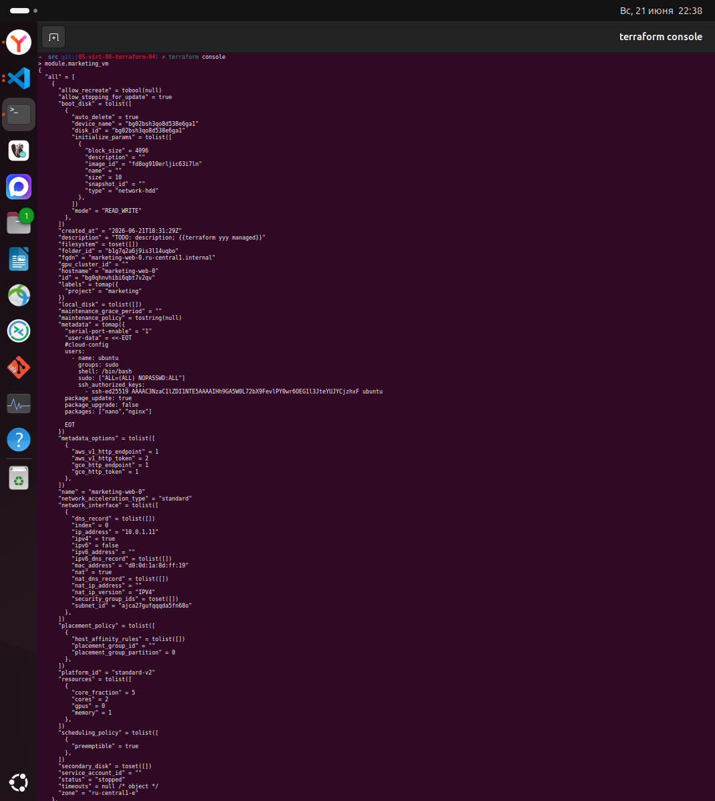
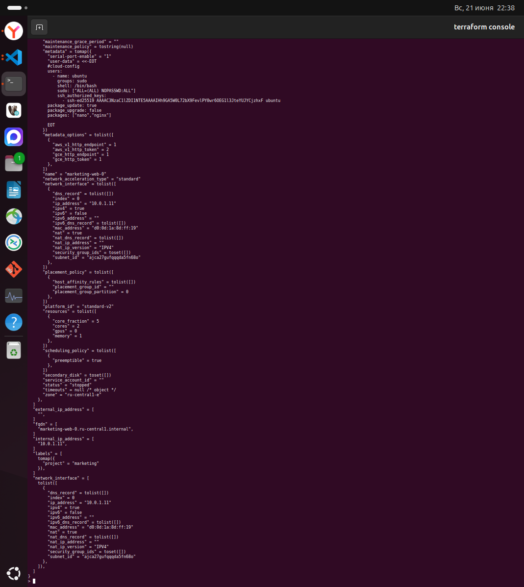

------
------

### Задание 2

1. Напишите локальный модуль vpc, который будет создавать 2 ресурса: **одну** сеть и **одну** подсеть в зоне, объявленной при вызове модуля, например: ```ru-central1-a```.
2. Вы должны передать в модуль переменные с названием сети, zone и v4_cidr_blocks.
3. Модуль должен возвращать в root module с помощью output информацию о yandex_vpc_subnet. Пришлите скриншот информации из terraform console о своем модуле. Пример: > module.vpc_dev  
4. Замените ресурсы yandex_vpc_network и yandex_vpc_subnet созданным модулем. Не забудьте передать необходимые параметры сети из модуля vpc в модуль с виртуальной машиной.
5. Сгенерируйте документацию к модулю с помощью terraform-docs.
 
Пример вызова

```
module "vpc_dev" {
  source       = "./vpc"
  env_name     = "develop"
  zone = "ru-central1-a"
  cidr = "10.0.1.0/24"
}
```

------

_**Выполнение**_:  
1. Создан каталог `vpc` с файлами `main.tf`, `outputs.tf`, `variables.tf`
2. Попытка выполнения `terraform init` очень долго заканчивалась ошибкой, которую не понятно как решать:
    ```sh
    ➜  src git:(05-virt-06-terraform-04) ✗ terraform init               
    Initializing modules...
    Initializing provider plugins found in the configuration...
    - Reusing previous version of yandex-cloud/yandex from the dependency lock file
    - Finding latest version of hashicorp/yandex...
    - Reusing previous version of hashicorp/template from the dependency lock file
    - Using previously-installed yandex-cloud/yandex v0.116.0
    - Using previously-installed hashicorp/template v2.2.0
    ╷
    │ Error: Invalid provider registry host
    │ 
    │ The host "registry.terraform.io" given in provider source address "registry.terraform.io/hashicorp/yandex" does not offer a Terraform provider registry.
    ╵
    ➜  src git:(05-virt-06-terraform-04) ✗ 
    ```  
    Перепробовал разные версии как `terraform` так и `yandex-cloud/yandex`.  
    Пробовал выполнять работу под другим пользователем и на другой вартуалке с чистым окружением.  
    В итоге помогло создание файла `vpc\providers.tf`.  

    Демонстрация ошибки и успешного выполнения:  
    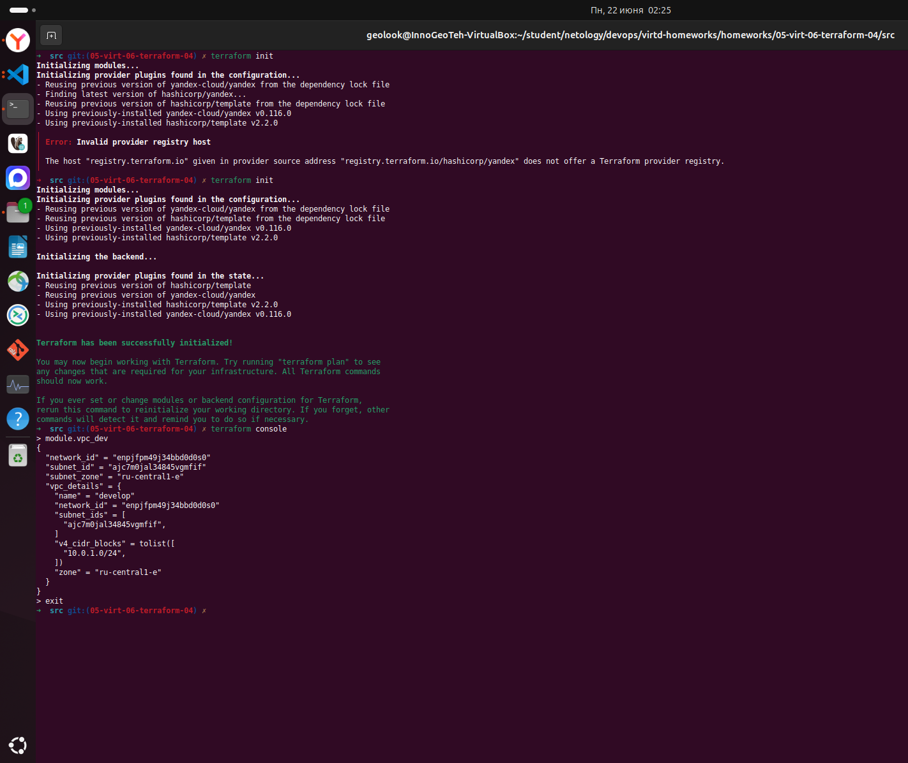  

    Демонстрация сети и её использования ВМ:  
    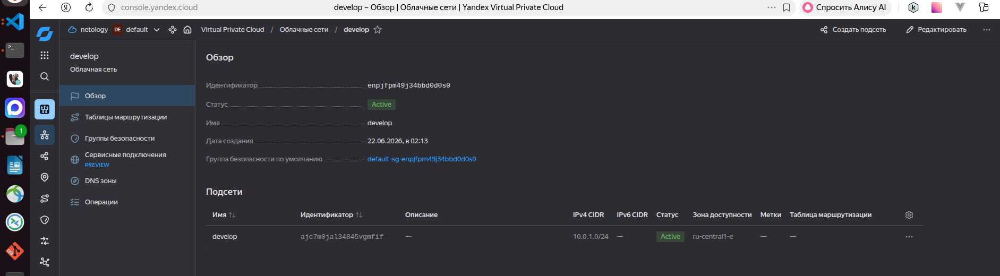  
    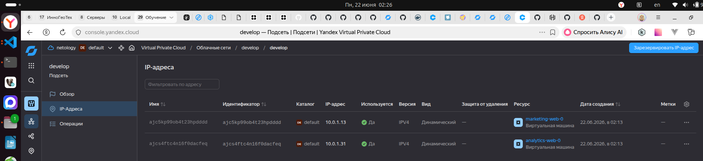  

3. Установка `terraform-docs` и генерация документации `terraform-docs markdown vpc/ > vpc/README.md`:

    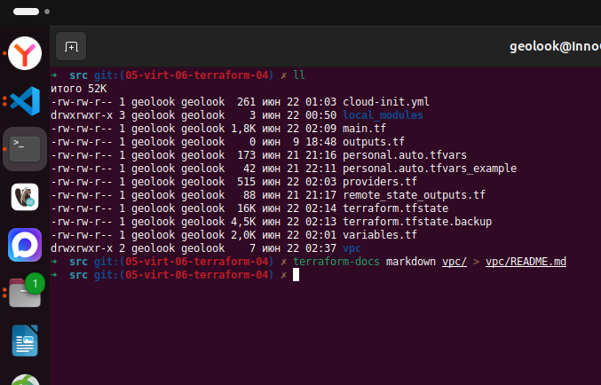 

------
------

### Задание 3
1. Выведите список ресурсов в стейте.
2. Полностью удалите из стейта модуль vpc.
3. Полностью удалите из стейта модуль vm.
4. Импортируйте всё обратно. Проверьте terraform plan. Значимых(!!) изменений быть не должно.
Приложите список выполненных команд и скриншоты процессы.

------

_**Выполнение**_:  
1. 

------
------

## Дополнительные задания (со звёздочкой*)

**Настоятельно рекомендуем выполнять все задания со звёздочкой.**   Они помогут глубже разобраться в материале.   
Задания со звёздочкой дополнительные, не обязательные к выполнению и никак не повлияют на получение вами зачёта по этому домашнему заданию. 

------
------

### Задание 4*

1. Измените модуль vpc так, чтобы он мог создать подсети во всех зонах доступности, переданных в переменной типа list(object) при вызове модуля.  
  
Пример вызова
```
module "vpc_prod" {
  source       = "./vpc"
  env_name     = "production"
  subnets = [
    { zone = "ru-central1-a", cidr = "10.0.1.0/24" },
    { zone = "ru-central1-b", cidr = "10.0.2.0/24" },
    { zone = "ru-central1-c", cidr = "10.0.3.0/24" },
  ]
}

module "vpc_dev" {
  source       = "./vpc"
  env_name     = "develop"
  subnets = [
    { zone = "ru-central1-a", cidr = "10.0.1.0/24" },
  ]
}
```

Предоставьте код, план выполнения, результат из консоли YC.

------
------

### Задание 5*

1. Напишите модуль для создания кластера managed БД Mysql в Yandex Cloud с одним или несколькими(2 по умолчанию) хостами в зависимости от переменной HA=true или HA=false. Используйте ресурс yandex_mdb_mysql_cluster: передайте имя кластера и id сети.
2. Напишите модуль для создания базы данных и пользователя в уже существующем кластере managed БД Mysql. Используйте ресурсы yandex_mdb_mysql_database и yandex_mdb_mysql_user: передайте имя базы данных, имя пользователя и id кластера при вызове модуля.
3. Используя оба модуля, создайте кластер example из одного хоста, а затем добавьте в него БД test и пользователя app. Затем измените переменную и превратите сингл хост в кластер из 2-х серверов.
4. Предоставьте план выполнения и по возможности результат. Сразу же удаляйте созданные ресурсы, так как кластер может стоить очень дорого. Используйте минимальную конфигурацию.

------
------

### Задание 6*
1. Используя готовый yandex cloud terraform module и пример его вызова(examples/simple-bucket): https://github.com/terraform-yc-modules/terraform-yc-s3 .
Создайте и не удаляйте для себя s3 бакет размером 1 ГБ(это бесплатно), он пригодится вам в ДЗ к 5 лекции.

------
------

### Задание 7*

1. Разверните у себя локально vault, используя docker-compose.yml в проекте.
2. Для входа в web-интерфейс и авторизации terraform в vault используйте токен "education".
3. Создайте новый секрет по пути http://127.0.0.1:8200/ui/vault/secrets/secret/create
Path: example  
secret data key: test 
secret data value: congrats!  
4. Считайте этот секрет с помощью terraform и выведите его в output по примеру:
```
provider "vault" {
 address = "http://<IP_ADDRESS>:<PORT_NUMBER>"
 skip_tls_verify = true
 token = "education"
}
data "vault_generic_secret" "vault_example"{
 path = "secret/example"
}

output "vault_example" {
 value = "${nonsensitive(data.vault_generic_secret.vault_example.data)}"
} 

Можно обратиться не к словарю, а конкретному ключу:
terraform console: >nonsensitive(data.vault_generic_secret.vault_example.data.<имя ключа в секрете>)
```
5. Попробуйте самостоятельно разобраться в документации и записать новый секрет в vault с помощью terraform. 

------
------

### Задание 8*
Попробуйте самостоятельно разобраться в документаци и с помощью terraform remote state разделить root модуль на два отдельных root-модуля: создание VPC , создание ВМ . 

### Правила приёма работы

В своём git-репозитории создайте новую ветку terraform-04, закоммитьте в эту ветку свой финальный код проекта. Ответы на задания и необходимые скриншоты оформите в md-файле в ветке terraform-04.

В качестве результата прикрепите ссылку на ветку terraform-04 в вашем репозитории.

**Важно.** Удалите все созданные ресурсы.

### Критерии оценки

Зачёт ставится, если:

* выполнены все задания,
* ответы даны в развёрнутой форме,
* приложены соответствующие скриншоты и файлы проекта,
* в выполненных заданиях нет противоречий и нарушения логики.

На доработку работу отправят, если:

* задание выполнено частично или не выполнено вообще,
* в логике выполнения заданий есть противоречия и существенные недостатки. 


