# Домашнее задание к занятию «Использование Terraform в команде»

### Цели задания

1. Научиться использовать remote state с блокировками.
2. Освоить приёмы командной работы.


### Чек-лист готовности к домашнему заданию

1. Зарегистрирован аккаунт в Yandex Cloud. Использован промокод на грант.
2. Установлен инструмент Yandex CLI.
3. Любые ВМ, использованные при выполнении задания, должны быть прерываемыми, для экономии средств.

------
### Внимание!! Обязательно предоставляем на проверку получившийся код в виде ссылки на ваш github-репозиторий!
Убедитесь что ваша версия **Terraform** ~>1.12.0
Пишем красивый код, хардкод значения не допустимы!

------
------

### Задание 0
1. Прочтите статью: [https://neprivet.com/](neprivet/neprivet.md)
2. Пожалуйста, распространите данную идею в своем коллективе. (собственно, делюсь)

------
------

### Задание 1

1. Возьмите код:
- из [ДЗ к лекции 4](https://github.com/netology-code/ter-homeworks/tree/main/04/src),
- из [демо к лекции 4](https://github.com/netology-code/ter-homeworks/tree/main/04/demonstration1).
2. Проверьте код с помощью tflint и checkov. Вам не нужно инициализировать этот проект.
3. Перечислите, какие **типы** ошибок обнаружены в проекте (без дублей).

------

**Выполнение**:

1. Установка tflint и checkov (_span у меня конфликтует с zfs, поэтому такая установка_):

    ```bash
    curl -s https://raw.githubusercontent.com/terraform-linters/tflint/master/install_linux.sh | bash
    pip3 install checkov
    ```
    Проверка установки:
    ```bash
    tflint --version
    checkov --version
    ```
    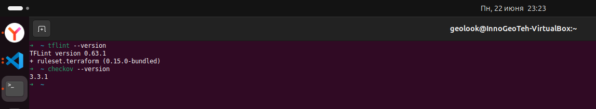

2. Проверка `src`

    ```bash
    cd src
    tflint --init 
    tflint
    checkov -d .
    ```
    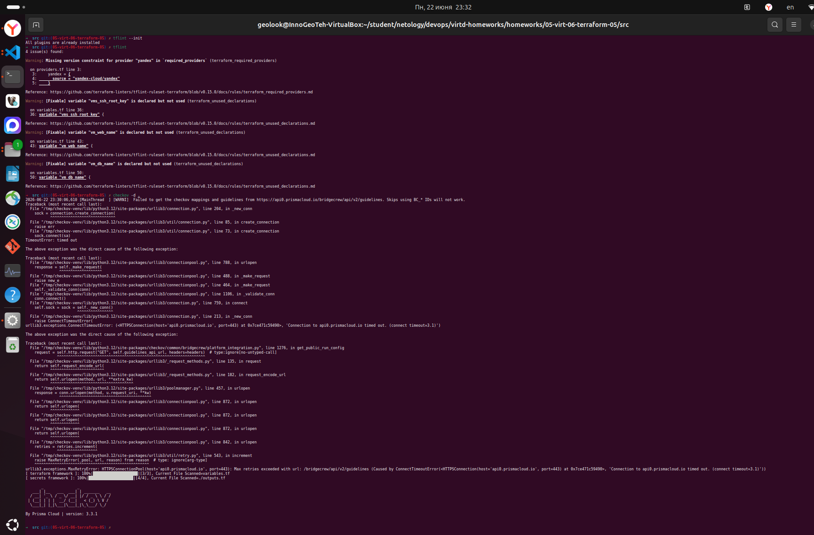

3. Проверка `demonstration1/vms/`

    ```bash
    cd demonstration1/vms
    tflint --init 
    tflint
    checkov -d .
    ```
    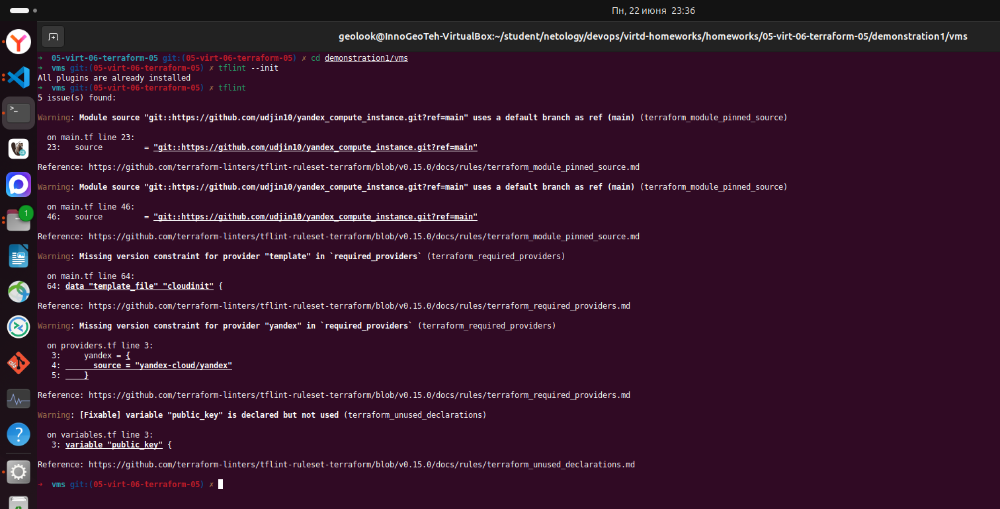
    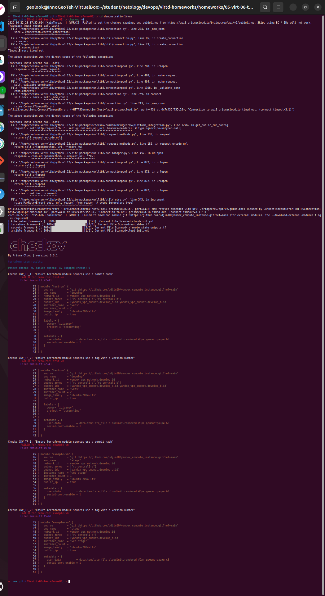

4. Сгруппированные типы ошибок:

    **Каталог 04/src/**
    - _tflint_ - 2 типа ошибок:
      - _**terraform_required_providers**_ - отсутствует version constraint для провайдера yandex в блоке required_providers
      - _**terraform_unused_declarations**_ - неиспользуемые переменные (vms_ssh_root_key, vm_web_name, vm_db_name)
    - _checkov_ - ошибок не обнаружено (сканирование завершилось без failed checks).
    
    **Каталог 04/demonstration1/vms/**
    - _tflint_ - 3 типа ошибок:
      - _**terraform_module_pinned_source**_ - модули (test-vm, example-vm) используют ветку по умолчанию ref=main вместо фиксированного тега или коммита
      - _**terraform_required_providers**_ - отсутствует version constraint для провайдеров yandex и template в блоке required_providers
      - _**terraform_unused_declarations**_ - неиспользуемая переменная public_key
    - _checkov_ - 2 типа ошибок:
      - _**CKV_TF_1**_ - Ensure Terraform module sources use a commit hash (модули test-vm и example-vm используют ветку main, а не commit hash)
      - **_CKV_TF_2_** - Ensure Terraform module sources use a tag with a version number (модули test-vm и example-vm используют ветку main, а не tag с версией)


------
------

### Задание 2

1. Возьмите ваш GitHub-репозиторий с **выполненным ДЗ 4** в ветке 'terraform-04' и сделайте из него ветку 'terraform-05'.
2. Настройте remote state с встроенными блокировками:
   - Создайте S3 bucket в Yandex Cloud для хранения state (если еще не создан)
   - Создайте service account с правами на чтение/запись в bucket
   - Настройте backend в providers.tf с использованием нового механизма блокировок:
     ```hcl
     terraform {
       required_version = "~>1.12.0"
       
       backend "s3" {
         bucket  = "ваш-bucket-name"
         key     = "terraform.tfstate"
         region  = "ru-central1"
         
         # Встроенный механизм блокировок (Terraform >= 1.6)
         # Не требует отдельной базы данных!
         use_lockfile = true
         
         endpoints = {
           s3 = "https://storage.yandexcloud.net"
         }
         
         skip_region_validation      = true
         skip_credentials_validation = true
         skip_requesting_account_id  = true
         skip_s3_checksum            = true
       }
     }
     ```
   - Выполните `terraform init -migrate-state` для миграции state в S3
   - Предоставьте скриншоты процесса настройки и миграции
3. Закоммитьте в ветку 'terraform-05' все изменения.
4. Откройте в проекте terraform console, а в другом окне из этой же директории попробуйте запустить terraform apply.
5. Пришлите ответ об ошибке доступа к state (блокировка должна сработать автоматически).
6. Принудительно разблокируйте state командой `terraform force-unlock <LOCK_ID>`. Пришлите команду и вывод.

**Примечание:** В Terraform >= 1.6 появился встроенный механизм блокировок через `use_lockfile = true`. 
Это упрощает настройку - больше не нужно создавать отдельную базу данных (YDB в режиме DynamoDB) для хранения блокировок.
Lock-файл создается автоматически в том же S3 bucket рядом с state-файлом с именем `<key>.lock.info`.

------

**Выполнение**:

1. Сделал ветку 'terraform-05' из ветки 'terraform-04' (у меня они назывались иначе, так что адаптировал команды).

    ```bash
    git checkout 05-virt-06-terraform-04
    git checkout -b 05-virt-06-terraform-04-terraform-05
    git push origin 05-virt-06-terraform-04-terraform-05
    ```
    Ветка с изменёнными файлами выполнения задания - [05-virt-06-terraform-04-terraform-05](https://github.com/iGureEV/virtd-homeworks/tree/05-virt-06-terraform-04-terraform-05/homeworks).

2. В задании 6 в ДЗ 4 был создан S3 bucket в Yandex Cloud

    Проверен альтернативный вариант через YC CLI:

    ```bash
    yc storage bucket create --name terraform-state-netology2 --max-size 1073741824
    ```
    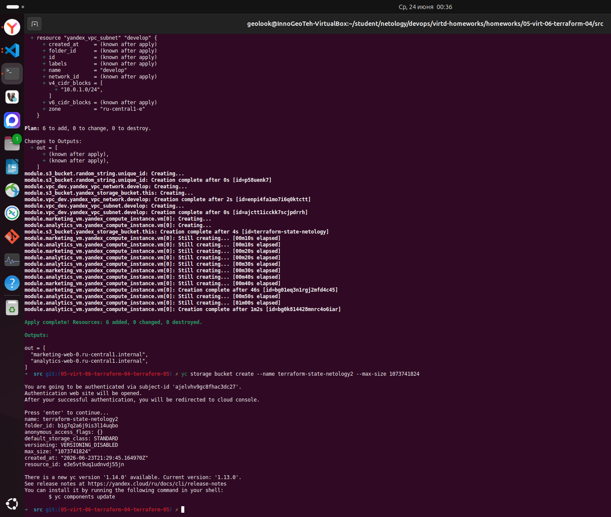
    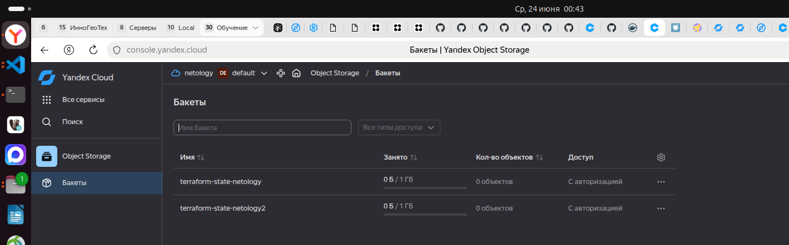

3. Создал сервисный аккаунт, дал права редактирования на хранилище и статический ключ

    ```bash
    yc iam service-account create --name tf-netology-editor

    SA_ID=$(yc iam service-account get --name tf-netology-editor --format json | jq -r '.id')

    yc resource-manager folder add-access-binding <folder_id> --role storage.editor --subject serviceAccount:$SA_ID

    yc iam access-key create --service-account-name tf-netology-editor
    ```

    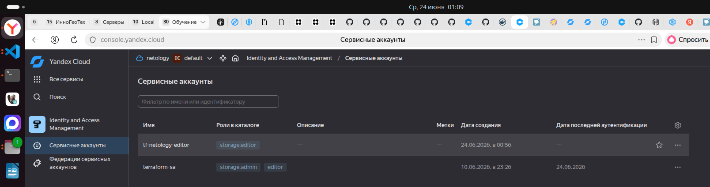

4. Закоммитил изменения в ветку [05-virt-06-terraform-04-terraform-05](https://github.com/iGureEV/virtd-homeworks/tree/05-virt-06-terraform-04-terraform-05/homeworks)
5. Сохранил ключ в файл `~/.aws/credentials` (_альтернатива - переменные окружения_) и перенёс стейт

    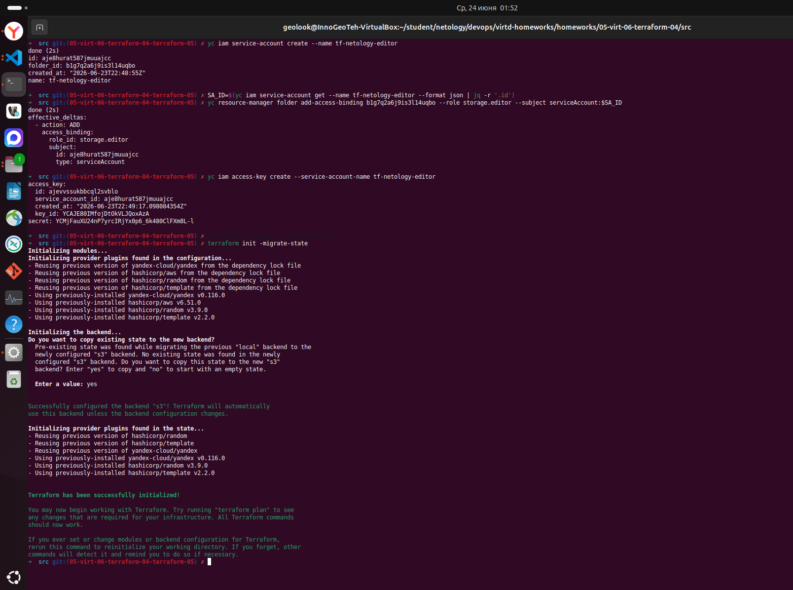
    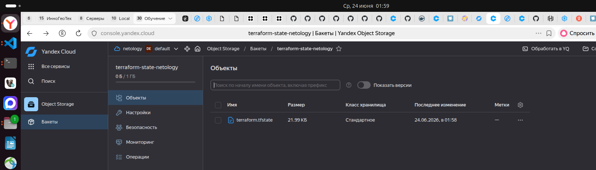

5. Запустил в одном терминале `terraform plan` и одновременно в другом `terraform apply` (запуск `terraform console` не давал блокировку)

    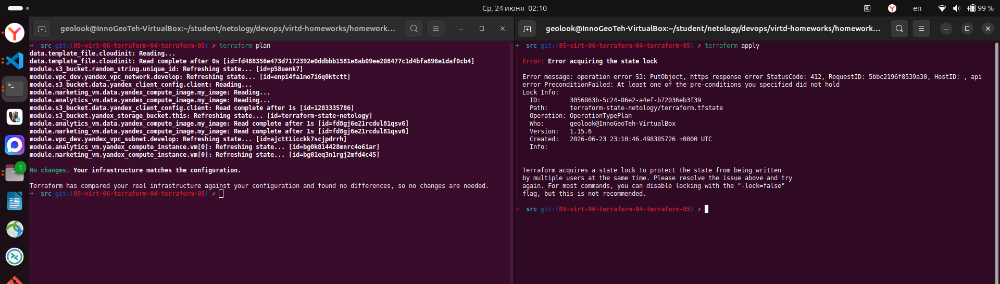

6. Попробовал снять блокировку командой `terraform force-unlock <LOCK_ID>`, но она уже была снята из-за завершения операции, однако принцип я понял - должна появиться `terraform state has been success unlocked!` (по инфе из сети).

    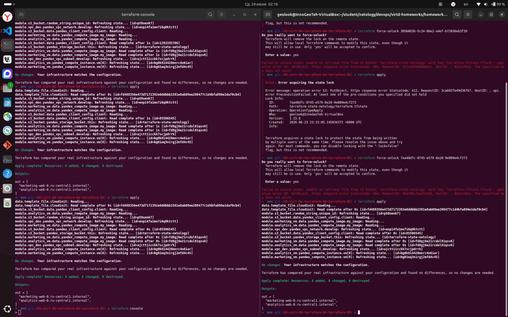

------
------

### Задание 3  

1. Сделайте в GitHub из ветки 'terraform-05' новую ветку 'terraform-hotfix'.
2. Проверье код с помощью tflint и checkov, исправьте все предупреждения и ошибки в 'terraform-hotfix', сделайте коммит.
3. Откройте новый pull request 'terraform-hotfix' --> 'terraform-05'. 
4. Вставьте в комментарий PR результат анализа tflint и checkov, план изменений инфраструктуры из вывода команды terraform plan.
5. Пришлите ссылку на PR для ревью. Вливать код в 'terraform-05' не нужно.

------

**Выполнение**:

1. Сделал ветку 'terraform-hotfix' из ветки 'terraform-05' (у меня они назывались иначе, так что адаптировал команды).

    ```bash
    git checkout 05-virt-06-terraform-04-terraform-05
    git checkout -b 05-virt-06-terraform-04-terraform-05-terraform-hotfix
    git push origin 05-virt-06-terraform-04-terraform-05-terraform-hotfix
    ```
    Ветка с изменёнными файлами выполнения задания - [05-virt-06-terraform-04-terraform-05](https://github.com/iGureEV/virtd-homeworks/tree/05-virt-06-terraform-04-terraform-05-terraform-hotfix/homeworks).

2. Были исправлены следующие ошибки (возможно лишнее, но пусть будет):

    **tflint**
    - В `src/main.tf` - для yandex_compute_instance и terraform-yc-s3 были указаны значения ref
    - В `src/variables.tf` - удалены переменные `subnet_b_cidr` и `image_family`
    - В `demonstration1/vms/main.tf` - для yandex_compute_instance указано значение ref и версия для template
    - В `demonstration1/vms/providers.tf` - указана версия для yandex
    - В `demonstration1/vms/variables.tf` - удалены переменные `public_key`

    **checkov**
    - В `src/main.tf` для `terraform-yc-s3` была указана версия, а чеков потребовал hash commit

    Найденные ошибки:
    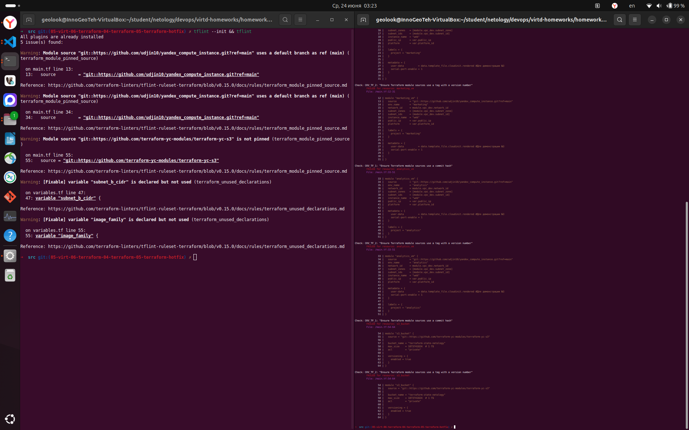
    Ошибок больше нет:
    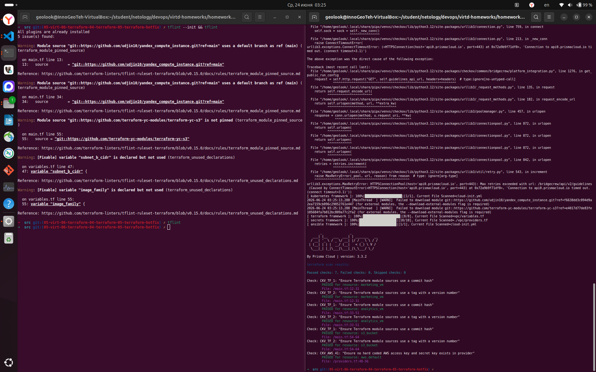
    Проверка плана:
    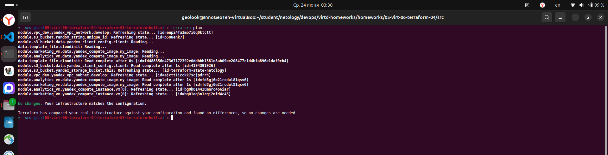

------
------

### Задание 4

1. Напишите переменные с валидацией и протестируйте их, заполнив default верными и неверными значениями. Предоставьте скриншоты проверок из terraform console. 

- type=string, description="ip-адрес" — проверка, что значение переменной содержит верный IP-адрес с помощью функций cidrhost() или regex(). Тесты:  "192.168.0.1" и "1920.1680.0.1";
- type=list(string), description="список ip-адресов" — проверка, что все адреса верны. Тесты:  ["192.168.0.1", "1.1.1.1", "127.0.0.1"] и ["192.168.0.1", "1.1.1.1", "1270.0.0.1"].

------

**Выполнение**:

1. В `variables.tf` описал переменные `ip_address` и `ip_list` с валидацией значений
2. Проверил обработку верных и неверных значений

    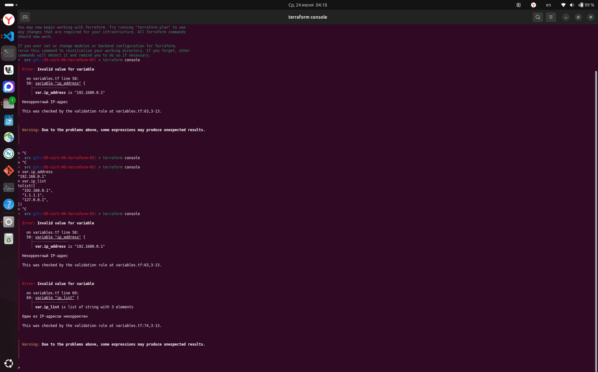

------
------

## Дополнительные задания (со звёздочкой*)

**Настоятельно рекомендуем выполнять все задания со звёздочкой.** Их выполнение поможет глубже разобраться в материале.   
Задания со звёздочкой дополнительные, не обязательные к выполнению и никак не повлияют на получение вами зачёта по этому домашнему заданию. 

------
------

### Задание 5*
1. Напишите переменные с валидацией:
- type=string, description="любая строка" — проверка, что строка не содержит символов верхнего регистра;
- type=object — проверка, что одно из значений равно true, а второе false, т. е. не допускается false false и true true:
```
variable "in_the_end_there_can_be_only_one" {
    description="Who is better Connor or Duncan?"
    type = object({
        Dunkan = optional(bool)
        Connor = optional(bool)
    })

    default = {
        Dunkan = true
        Connor = false
    }

    validation {
        error_message = "There can be only one MacLeod"
        condition = <проверка>
    }
}
```

------
------

### Задание 6*

1. Настройте любую известную вам CI/CD-систему. Если вы ещё не знакомы с CI/CD-системами, настоятельно рекомендуем вернуться к этому заданию после изучения Jenkins/Teamcity/Gitlab.
2. Скачайте с её помощью ваш репозиторий с кодом и инициализируйте инфраструктуру.
3. Уничтожьте инфраструктуру тем же способом.

------
------

### Задание 7*
1. Настройте отдельный terraform root модуль, который будет создавать инфраструктуру для remote state:
   - S3 bucket для tfstate с версионированием
   - Сервисный аккаунт с необходимыми правами (storage.editor)
   - Static access key для сервисного аккаунта
2. Output должен содержать:
   - Имя bucket
   - Access key ID и Secret key (sensitive)
   - Пример конфигурации backend для использования
3. После создания инфраструктуры используйте outputs для настройки backend в основном проекте.

**Примечание:** Так как используется `use_lockfile = true`, создавать YDB/DynamoDB больше не требуется.
Блокировки реализованы встроенным механизмом Terraform и хранятся в том же S3 bucket. 

------
------

### Правила приёма работы

Ответы на задания и необходимые скриншоты оформите в md-файле в ветке terraform-05.

В качестве результата прикрепите ссылку на ветку terraform-05 в вашем репозитории.

**Важно.** Удалите все созданные ресурсы.

### Критерии оценки

Зачёт ставится, если:

* выполнены все задания,
* ответы даны в развёрнутой форме,
* приложены соответствующие скриншоты и файлы проекта,
* в выполненных заданиях нет противоречий и нарушения логики.

На доработку работу отправят, если:

* задание выполнено частично или не выполнено вообще,
* в логике выполнения заданий есть противоречия и существенные недостатки. 