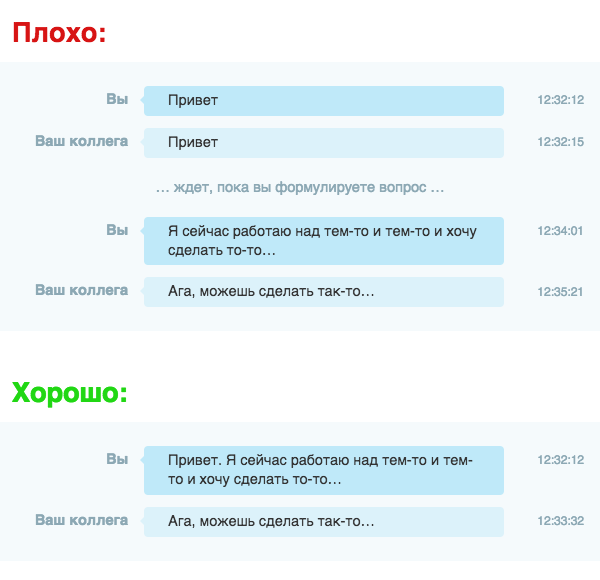

# Не привет

**Пожалуйста, не пишите просто «Привет» в чате**

Почему не нужно писать «Привет» первым сообщением в чате. Простое правило, которым нужно пользоваться всем, для улучшения коммуникации в чатах и мессенджерах.

---

## Как не надо

| Вы | Ваш коллега |
|----|-------------|
| Привет | |
| | Привет |
| *(ждёт, пока вы формулируете вопрос)* | |
| Я сейчас работаю над тем-то и тем-то и хочу сделать то-то… | |
| | Ага, можешь сделать так-то… |

Получается, как будто вы звоните кому-то по телефону, говорите «Привет!» и ставите его на ожидание.

## Как надо

| Вы | Ваш коллега |
|----|-------------|
| Привет. Я сейчас работаю над тем-то и тем-то и хочу сделать то-то… | |
| | Привет. Ага, можешь сделать так-то… |

Заметьте, вы получаете обратную связь быстрее и не заставляете собеседника ждать, и он начинает думать над вашим вопросом сразу.

---

Вы стараетесь быть вежливым, не переходя сразу к своей проблеме, как люди делают при личной встрече. Но чат — это совсем другое. Люди печатают намного медленнее, чем говорят. Вместо проявления вежливости, вы заставляете другого человека ждать, пока сформулируете вопрос, что приводит к потере производительности.

То же самое относится к таким сообщениям: «Здравствуйте», «Привет. Ты здесь?», «Здорова! Есть вопрос», «Есть минутка?», «Пинг». Просто задавайте вопрос!

Если вам кажется бесцеремонным просто сказать «Привет» и тут же задать вопрос, можете сделать так:

| Вы |
|----|
| Привет. Если ты сейчас не занят, я хотел поинтересоваться: могу ли я задать тебе вопрос? Я сейчас работаю над тем-то и тем-то и хочу сделать то-то… |

К тому же, когда вы задаёте вопрос сразу, открывается возможность асинхронного взаимодействия. Если собеседник недоступен, а вы уйдёте до того как он вернётся, он по-прежнему может ответить на вопрос, вместо того, чтобы смотреть на ваш «Привет» и думать, что же случилось.

---

Если вы увидели у кого-то в статусе ссылку на эту статью, будьте готовы, что ваш собеседник проигнорирует сообщение с одним «приветом».

## Суть одной картинкой

---

*Источник — [www.nohello.com](http://www.nohello.com) (перевод  [Andrey Samsonov](https://github.com/kryzhovnik))*  
*Оригинал — [www.neprivet.com](http://neprivet.com) (автор Brandon High)*