# Дипломная работа по модулю «Облачная инфраструктура. Terraform» курса «DevOps-инженер»

## Цель итогового проекта:

развернуть web-приложение для работы в облачной инфраструктуре Yandex Cloud.

**В результате выполнения итогового проекта:**

- получение опыта работы с облачной инфраструктурой Yandex Cloud
- применение принципа IaaC при работе с виртуальными машинами
- овладение навыками развертывания и настройки веб-приложений
- выполнение оркестрации контейнеров с Docker Compose и Docker Swarm
- получение опыта работы с Terraform для управления инфраструктурой

---

## Чек-лист готовности к работе над проектом:

- изучен основной и дополнительный теоретический материал по модулям «Виртуализация и контейнеризация» и «Облачная инфраструктура. Terraform»
- выполнены все обязательные домашние задания модулей

---

## Инструменты и дополнительные материалы для выполнения задания:

- Docker
- Docker Compose
- Terraform

---

## Описание итогового проекта:

Задания итогового проекта охватывают полный цикл создания и настройки инфраструктуры, установку необходимых инструментов, сборку и развертывание приложения, а также хранение образов в реестре контейнеров.

**В рамках итогового проекта:**

1. Собрано простое web-приложение на основании представленных Netology данных (с описанием Dockerfile, docker compose yml).
2. Настроена инфраструктура в Yandex Cloud с использованием Terraform.
3. Развернуто веь-приложение в облачной среде.

---
---

## Задание итогового проекта:

Используя инструменты Docker, Docker Compose и Terraform, необходимо сделать следующее:

**Задание 1.** Развертывание инфраструктуры в Yandex Cloud.

- Создать Virtual Private Cloud (VPC).
- Создать подсети.
- Создать виртуальные машины (VM):
  - Настроить группы безопасности (порты 22, 80, 443).
  - Привязать группу безопасности к VM.
- Описать создание БД MySQL в Yandex Cloud.
- Описать создание Container Registry.

**Задание 2.** Используя user-data (cloud-init), установите Docker и Docker Compose (см. Задания 5 модуля «Виртуализация и контейнеризация»).

**Задание 3.** Опишите Docker файл (см. Задания 5 «Виртуализация и контейнеризация») c web-приложением и сохраните контейнер в Container Registry.

**Задание 4.** Завяжите работу приложения в контейнере на БД в Yandex Cloud.

**Задание 5\*.** Положите пароли от БД в LockBox и настройте интеграцию с Terraform так, чтобы пароль для БД брался из LockBox.

---

### **Выполнение итогового проекта**

0. Выполнил тестовый прогон выполнения заданий и набросал план выполнения заданий.

1. Подготовил конфигурацию

    * Применены освоенные на предыдущих практиках приёмы развёртывания облачной инфраструктуры

    * Изучена документация по кластерам MySQL в облаке Яндекс

    * Описана минимальная конфигурация для развёртывания кластера MySQL в облаке Яндекс:
      * зона развертывания, класс кластера, ресурсы узла кластера, сеть, тип среды окружения (выбрана тестовая), версия сервера, не доступность кластера во вне

      ```tf
      resource "yandex_mdb_mysql_cluster" "this" {
        name                = "diplom-mysql"
        environment         = "PRESTABLE"
        network_id          = yandex_vpc_network.this.id
        version             = "8.0"
        deletion_protection = false

        resources {
          resource_preset_id = "s2.micro"
          disk_type_id       = "network-hdd"
          disk_size          = 10
        }

        host {
          zone             = var.zone
          subnet_id        = yandex_vpc_subnet.this.id
          assign_public_ip = false
        }
      }

      resource "yandex_mdb_mysql_database" "this" {
        cluster_id = yandex_mdb_mysql_cluster.this.id
        name       = "diplom_db"
      }
      ```

    * Описан Container Registry, пока пустой

    ```tf
    resource "yandex_container_registry" "this" {
      name = "diplom-registry"
    }
    ```

    * Используя `cloud-init.yml` описал установку Docker в ВМ.

    * Проверил конфигурацию и отработал замечания.

    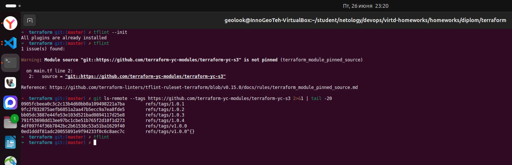

2. Развернул в Облаке Яндекс

    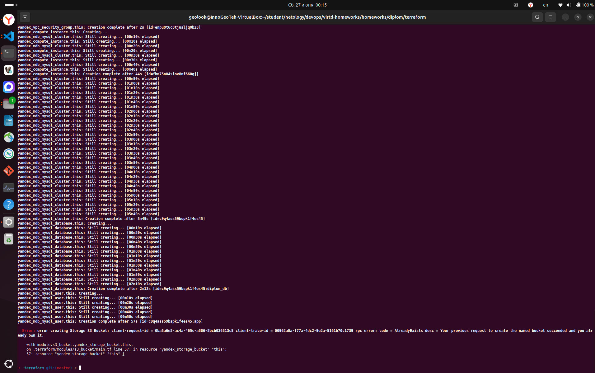  

    Баккет переиспользуется ранее созданный.

3. Проверил разворачивание

    Общий обзор развёртывания:  
    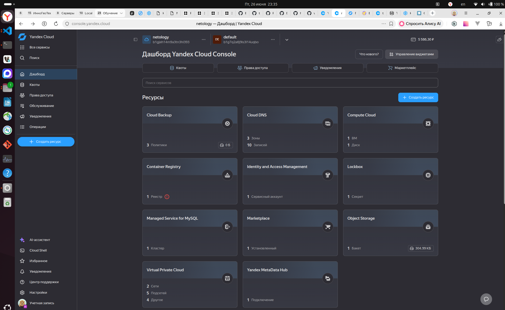  

    Проверка ВМ:  
    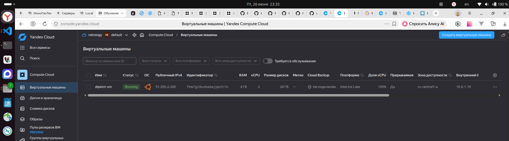  

    Бакет:  
    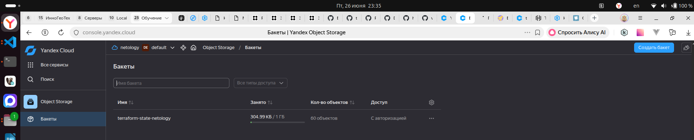  

    Сеть:  
    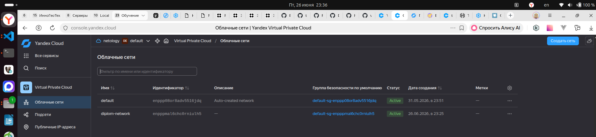  

    Кластер MySQL:  
    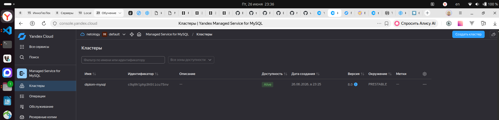  

    Docker в ВМ:  
    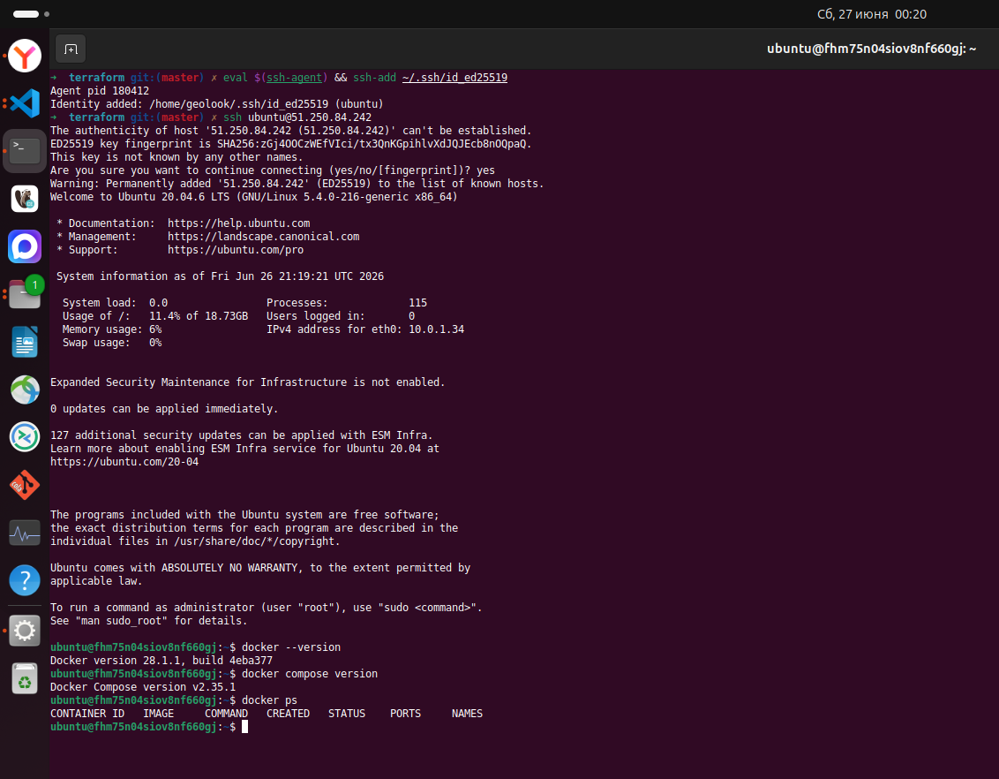  

4. Из `Задание 5 «Виртуализация и контейнеризация»` на основе репозитория [shvirtd-example-python](https://github.com/iGureEV/shvirtd-example-python) собрал образ и загрузил в Container Registry.

    ```sh
    cd homeworks/diplom/05-virt-04-docker-in-practice/shvirtd-example-python

    # сборка образа
    docker build -f Dockerfile.python -t shvirtd-example-python:latest .

    # Аутентификация в Container Registry
    yc container registry configure-docker

    # загрузка образа в Container Registry
    REGISTRY_ID=<id-из-terraform-output>
    REGISTRY_URL=cr.yandex/$REGISTRY_ID

    docker tag shvirtd-example-python:latest $REGISTRY_URL/shvirtd-example-python:latest

    docker push $REGISTRY_URL/shvirtd-example-python:latest
    ```

    Сборка Docker образа:  
    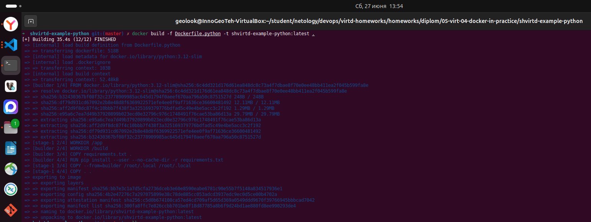  

    Загрузка Docker образа в Container Registry:  
    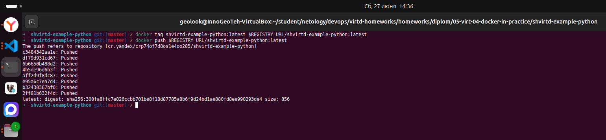  

    Обзор образа в Container Registry:  
    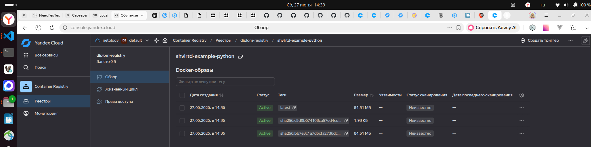  

5. Связал приложение с облачным MySQL кластером.

    * Получил FQDN кластера MySQL кластера:

    ```sh
    terraform output mysql_host_fqdn
    ```

    * Заполнил `.env` файл:

    ```sh
    MYSQL_HOST = <host>
    MYSQL_PASSWORD = <password>
    ````

    * Создал `diplom.yaml` файл в каталоге `shvirtd-example-python`

    * Скопировал проект в ВМ:

    ```sh
    scp -r ./shvirtd-example-python ubuntu@51.250.84.242:~/shvirtd-example-python
    ssh ubuntu@51.250.84.242
    sudo mv ~/shvirtd-example-python /opt/
    cd /opt/shvirtd-example-python
    sudo docker compose up -d
    docker ps
    curl http://localhost:8090
    ```

    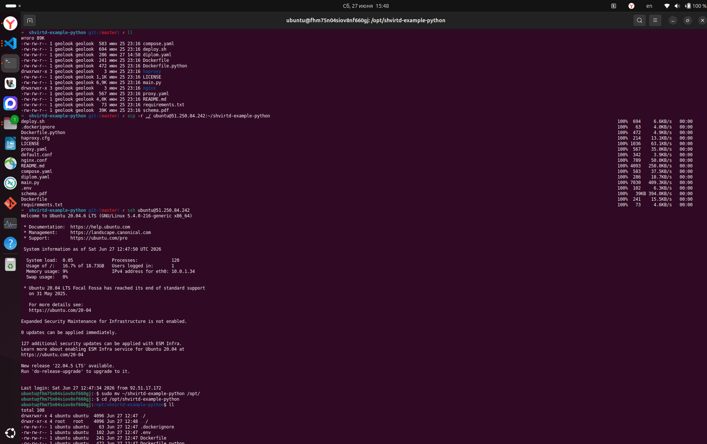  
    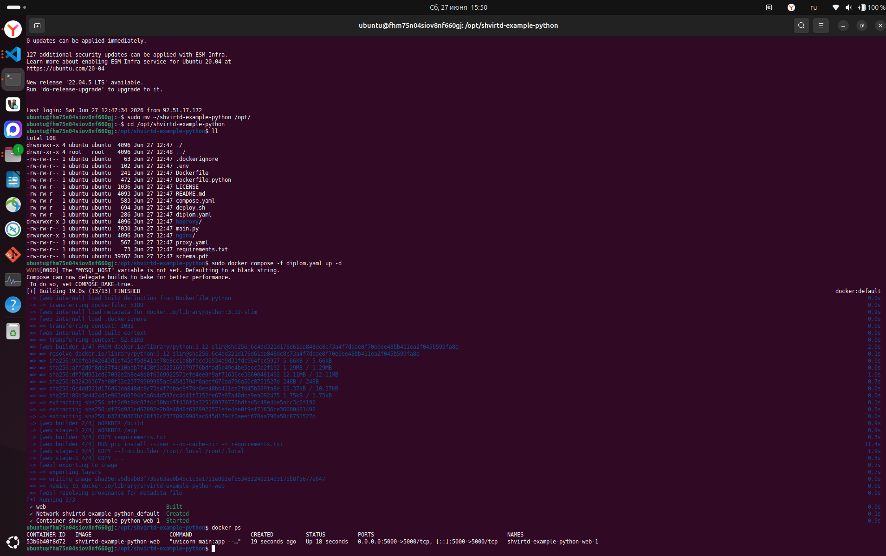  
    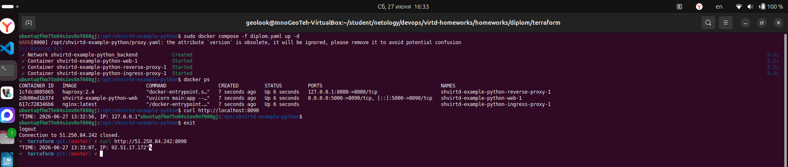  
    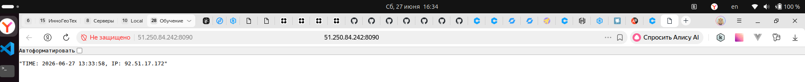  


---
---

## Чек-лист готовности итоговой работы:

- инфраструктура в Yandex Cloud описана без хардкода, state хранится удаленно, подключен statelocking
- Docker и Docker Compose установлены через cloud-init
- Dockerfile включает мультисборку и сохранение образа в Container Registry
- приложения доступны по ip-адресу машины (в усложненном варианте - настроить DNS)
- создан MD-файл, который корректно оформлен и содержит примеры, скриншоты, ссылки

---

## Формат сдачи проекта:

1. Опишите проект в MD-файле, сформируйте ссылку и загрузите в Git репозиторий.
2. Вставьте ссылку на вашу работу в поле «Ссылка на решение» и нажмите «Отправить».
